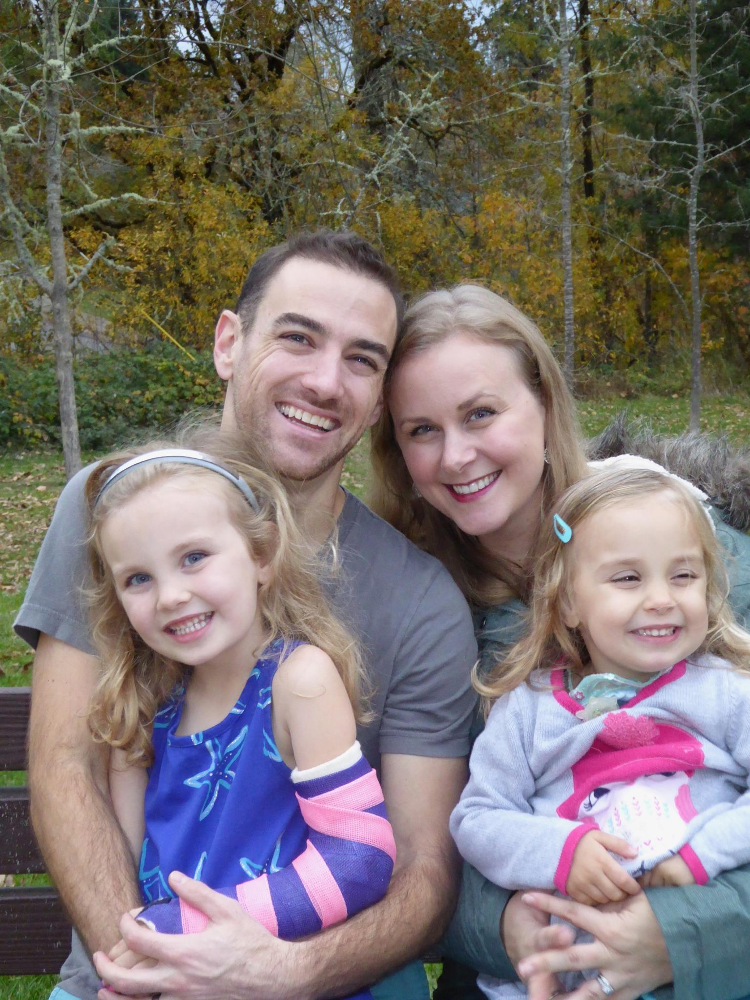
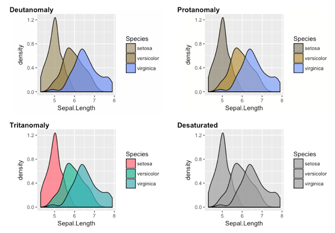
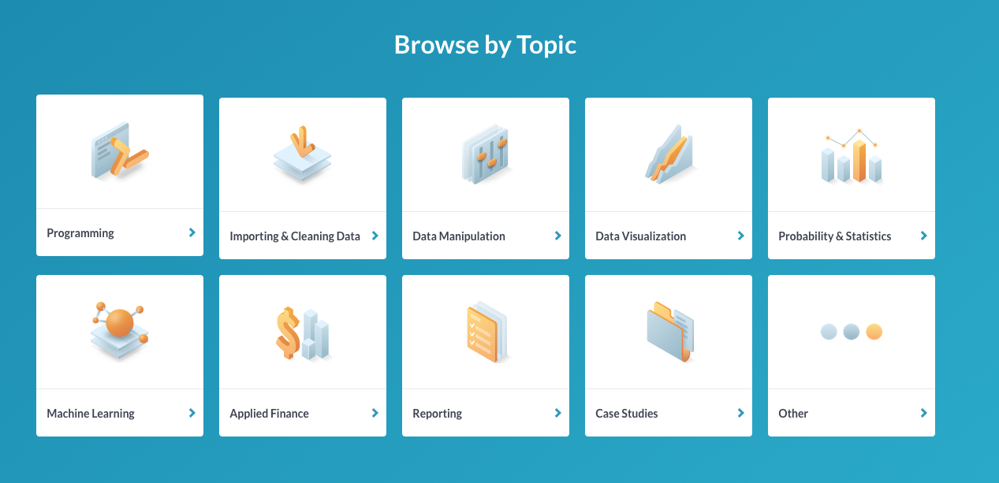

# Agenda 

* Introductions
* Syllabus
* Introduce R

Overall purpose of today: 
* Understand the course requirements
* Get you excited about R! 
  + This week will be a lot of me showing, and not a lot of you doing. That will change quickly.

---
# Who are you?
* Please introduce yourself. 
  + Name/Program of study and things you're interested in
  + Prior experience with R
  + Why do you want to learn R?

---
# Who am I?
.pull-left[
* Research Assistant Professor: Behavioral Research and Teaching
* Dad (two daughters: 6 and 4)
* Primary areas of interest
  + 💗💗R💗💗 and computational research 
  + Open data, open science, and reproducible workflows
  + Growth modeling, achievement gaps, and variance between educational institutions
]

.pull-right[

]


---
class: inverse

# What this class is about

.center[🎉 Celebrating Successes 🎉]

.center[🎉 Celebrating Failures    🎉]

.center[🎉 Celebrating **Trying**  🎉]

--
<br/>


.major-emph-yellow[Learning to problem solve]

---

## Daily shares
* I will try to start each class by asking people to share out. 
  + What successes have you had? What spectacular failures? 
  + **Totally** voluntary
  + This class should function, in part, as an [#rstats](https://twitter.com/search?q=%23rstats&src=tyah) support-group
  

--

<iframe src="https://giphy.com/embed/QbkL9WuorOlgI" width="480" height="258" frameBorder="0" class="giphy-embed" allowFullScreen></iframe><p><a href="https://giphy.com/gifs/hug-minions-love-QbkL9WuorOlgI"></a></p>


---

# A few sharing examples
Recent conference presentation turned article: Evaluating school-level achievement gaps.

<iframe seamless src="assets/alameda_poverty.html" width="100%" height="415"></iframe>

---
# The *colorblindr* package
Simulate what a plot would look like according to 4 different types of color blindness.

.pull-left[

]

.pull-right[

]

---
background-image: url(assets/img/oh_places_go.png)
class: center inverse

# .grey[Syllabus]

---
# Course GitHub page

* You will need a GitHub account
  + We'll make sure you have one by the end of the week
* Eventually, you'll turn in assignments via GitHub
* Syllabus and all course materials will always be on the course Github page:
  + https://github.com/uo-datasci-specialization/c1-intro_data_sci

---
# Course Learning Outcomes
1. Understand the R package ecosystem (how to find, install, load, and learn about them)

--

1. Read "flat" (i.e., rectangular) datasets into R 

--

1. Perform basic data wrangling and transformations in R, using the tidyverse
  + Leverage appropriate functions for introductory data science tasks (pipeline)
  + "clean up" the dataset using scripts and reproducible workflows

--

1. Use version control with R via Git through RStudio Projects

--

1. Use R Markdown to create reproducible dynamic reports, including APA manuscripts

--

1. Understand and create different types of data visualizations

---
# Weekly learning objectives

Provide you a frame for what you should be working to learn for that specific week.

--

### This week's objectives
* Understand the requirements of the course
* Understand the requirements of the final project
* Understand what distinguishes R from other data and statistical platforms
* Understand the basics of the R ecosystem
	+ What's a package? How do you get one? How do you use it?


---
### By the end of the week you should:
* Have R, RStudio, and git installed on your computer and talking to each other
* Have a GitHub account
* Be setup with DataCamp and working through the introduction to the tidyverse

---
# What this class is and is not

--

### Three foci
* Data structuring and manipulations
* Reproducible workflows
* Data visualization 


--

### This class is not
* All encompassing 
  + First of the series
* A statistics course 
  + We'll use stats in examples, though

---
# Required Textbooks (free)

.pull-left[

http://r4ds.had.co.nz

<div>

</div>

]

.pull-right[
http://www.moderndive.com

]


---
# Other books (also free)

.pull-left[
http://socviz.co
<div>

</div>
]

.pull-right[
http://happygitwithr.com
<div>

</div>
]

---
# DataCamp
* Everyone should have received a datacamp invite. Contact me if not. 
* Great platform for supplemental learning. 

.pull-left[

]

.pull-right[

]

---
# Before next class
* DataCamp chapters
  + [Introduction to the tidyverse](https://www.datacamp.com/courses/introduction-to-the-tidyverse), Chapters 1 & 2
  + [RStudio IDE](https://www.datacamp.com/courses/working-with-the-rstudio-ide-part-1), Chapter 1

--

Style guide! Have good grammar when you code.

http://adv-r.had.co.nz/Style.html

Some quick advice:
* Keep everything lower case, unless there's a clear resason not to
* Use style that helps you spot errors in your code more quickly
* Whatever you do, be consistent

---
# Class format
### Practice, Practice, Practice
General format will include:
* ~5 minutes discussing last class topics
* 15-20 minutes of lecture on new topic
* ~60 minutes working through challenges

All challenges are due before the next class. What you do not complete in class must be completed on your own time.

This structure is intended to provide you with lots of practice, and lots of time with me to help you puzzle through your problems.

---
class: inverse center middle
# A few good reminders

---
class: inverse
background-image: url(assets/img/failing.png)
background-size: contain

---
class: inverse
background-image: url(assets/img/impost-r.png)
background-size: contain

---
# Scope and sequence: Labs
1. Intro to R and RStudio
1. Scatterplots with smooths; line plots
1. Histograms, boxplots, barplots
1. Importing data of different types; summarizing grouped data
1. Lesser known 🌟 of {dplyr}
1. R Markdown
1. Getting started with version control (*git* and GitHub)
1. Creating APA Manuscripts with R Markdown
1. Customizing your APA Manuscript
1. Tidy data
1. Taming variables
1. Full exploratory analysis
1. More R Markdown + GitHub


---
# Final Project 
* Group project, 3-4 people
* APA manuscript

--

### Final project must:
* Be fully reproducible
  + This implies the data are open
* Be a collaborative project hosted on GitHub
* Move data from its raw "messy" format to a tidy data format
* Include at least two exploratory plots
* Include at least summary statistics of the data in tables, although fitted models are a plus.

--

.major-emph-green[Must use open data]

---
# For future reference
Final project must use the following functions:
* `gather`, `separate`, `select`, `filter`, `spread`, `group_by`, and `summarize`

---
# Final project Dates
* **Week 2a**: Self-selected groups finalized
* **Week 4b**: Final Project Outline Due
* **Week 8b**: Data prep script due to peer-review
* **Week 9b**: Peer review due
* **Week 10ab**: Final project presentations

---
# Project outline
Should include the following
* Description of the data to be used
* Discussion of preparatory work that needs to be done
* Anything you  want feedback from me on

Primary purpose: get feedback and give me a preview of your project.

---
# Data prep script
* Expected to be a work in progress
* Provided to your peers so they can learn from you as much as you can learn from their feedback

--

### Peer Review
* We are all professionals here. It is imperative we act like it. 
* Understand the purpose of the exercise.  
* Zero tolerance policy for inappropriate comments
* Should be vigorously encouraging 

---
class: inverse

background-image: url(https://mir-s3-cdn-cf.behance.net/project_modules/max_1200/1d393e34849077.56e0158a146e8.gif)

---
# Final project presentation 
Order randomly assigned. Should cover the following:

* Share your journey (everyone, at least for a minute or two)
* Discuss challenges you had along the way
* Celebrate your successes
* Discuss challenges you are still facing
* Discuss substantive findings
* Show off your cool data figures!
* Discuss next R hurdle you want to tackle

---
# Final Project
* APA Manuscript
  + Abstract, Intro, Methods, Results, Discussion
  + Should be brief: 35000 words max 
* No code displayed - should look like any other manuscript being submitted for publication
* Include at least 1 table
* Include at least 2 data displays
* Should be fully open, reproducible, and housed on GitHub
  + Should be able to clone your repository, open the R Studio Project, and reproduce the full manuscript (by knitting the R Markdown doc)

.major-emph-green[More info in Final Project doc]

---
# git and GitHub
This will be the first time we're trying this!
* Eventually will be required for homework
* Will be required for final project
* What is it?
  + Version control system
  + Collaboration tool
  + Can be powerful for transparency and reproducibility
  + More to come 😉

---
# Grading
* **Homework** (labs + DataCamp): 225 points (28%)
  + Labs (that end up as take-home exercises): 14 @ 10 points each = 140 points
  + DataCamp chapters: 17 @ 5 points each = 85 points
* **Final Project**: 200 points (42%)
  + Outline: 15 points
  + Data prep script: 25 points
  + Peer review: 25 points
  + Final Presentation: 25 points
  + Final Paper: 110 points


<br>

**Total Possible:** 435 points

---
# Grading

| **Lower percent** | **Lower point range** | **Grade** | **Upper point range** | **Upper percent** |
| :---------------: | :--------------------:| :-------: | :-------------------: | :---------------: |
|       0.97        | (422 pts)             |    A+     |                       |                   |
|       0.93        | (405 pts)             |     A     |       (422 pts)       |              0.97 |
|       0.90        | (392 pts)             |    A-     |       (405 pts)       |              0.93 |
|       0.87        | (378 pts)             |    B+     |       (392 pts)       |              0.90 |
|       0.83        | (361 pts)             |     B     |       (378 pts)       |              0.87 |
|       0.80        | (348 pts)             |    B-     |       (361 pts)       |              0.83 |
|       0.77        | (335 pts)             |    C+     |       (348 pts)       |              0.80 |
|       0.73        | (318 pts)             |     C     |       (335 pts)       |              0.77 |
|       0.70        | (304 pts)             |    C-     |       (318 pts)       |              0.73 |
|                   |                       |     F     |       (304 pts)       |              0.70 |

---
# Orientation of this course
* This course is oriented around the *tidyverse*. 
    + Very conscious decision that I really believe is the correct one.
    + The *tidyverse* is an alternative to base R functions

---
class: inverse center middle
background-image: url(https://pbs.twimg.com/media/DKSnpQcWkAEhJ0E.jpg)

.major-emph-green[Welcome to R]

---
# What is R?
* A programming language
* Tremendously powerful and flexible statistical software that happens to be free
* No point-and-click interface
* Incredible array of external "packages" available for specialized analyses, data visualizations, or to automate much of the data "munging" process

---
# Code-based interface


---
# Moving to code/programming

<br/>

.pull-left[
### Advantages
* Flexibility
  + Essentially anything is possible
* Transparency
  + Documented history of your analysis
* Efficiency
  + Many (most?) tasks can be automated
]

.pull-right[
### Disadvantages
* Steep learning curve
	+ Absolutely requires a significant time investment
	+ Equivalent to learning a new language
* You will lose patience with point-and-click interfaces
* Likely to become "one of the converted"
]

---
# The R Learning Curve

```{r, echo = FALSE, fig.height = 7.5, fig.width = 12}
curve(x^3, from = -50, to = 50, lty = 3, col = "cadetblue3", lwd = 3,
	axes = FALSE, xlab = "Time", ylab = "Learning", 
	main = "Steepness of the line roughly corresponds to your required effort")
axis(1, at = seq(-50, 50, 10),  labels = seq(0, 100, 10))
axis(2, at = seq(-1e5, 1e5, 2e4),  labels = seq(0, 101, 10))
```

---
# How to learn R?
* Three most important ingredients: time, time, and more time
* A sprinkling of dedication and determination help.
* Be patient and forgiving with yourself. It will feel slow at first. Most people have not trained themselves to think in this way.


---
# R as a big calculator

```{r calc_add}
3 + 2
```

```{r calc_eq}
(1/-(3/2)^2) / 2^-1/9
```

---
# Object Assignment
 
.pull-left[

### Assignment
```{r ob_assign1}
a <- 3
b <- 2
a + b
a / (a + b)
```

]

.pull-right[
### Re-assignment

```{r ob_assign2}
a <- 3
a
a <- 7
a
```

]

---
# Object Assignment (continued)

.pull-left[
Objects can be of a variety of types.

```{r ob_types}
string <- "Hello world!"
logical <- TRUE
double <- 3.2587021
Integer <- 6L
```
]

.pull-right[
In this case, we can't exactly do arithmetic with all of these. 
  For example

```{r, error = TRUE}
string + double
```
But, these objects can be extremely useful in programming.
]

---
# Functions and getting help

.pull-left[
### R functions
* Anything that carries out an operation in R is a function, even `+`. 
* Functions (outside of primitive functions) are preceded by `()`
    + e.g., `sum()`, `lm()`
]

.pull-right[
### Getting help
* `?` can be helpful, but often too advanced early on
    + Helpful for understanding the formal arguments of a function
    + Scroll down to the examples first
* Google is your  best friend
* Other good websites
  + [Stack Overflow](http://stackoverflow.com)
  + [Mailing lists](https://stat.ethz.ch/mailman/listinfo/r-help)
* Your classmates!
* Me!
]    

---
# A few examples of why I 💗 R

### Web stuff
* [xaringan](https://github.com/yihui/xaringan) - Used to produce these slides!
  + Shameless self-plug - [slidex](https://github.com/datalorax/slidex) will help you move from PowerPoint to xaringan!
* [blogdown](https://github.com/rstudio/blogdown) - Used to build your own (beautiful!) website!
* [rvest](https://github.com/hadley/rvest) - Used to scrape web data

### Data vis stuff
* [ggplot2](http://ggplot2.tidyverse.org) - Should be your default by the end of this class. Really powerful package.
* [plotly](https://plotly-book.cpsievert.me) - A good starting point for interactive data visualizations
* [altair](https://github.com/vegawidget/altair)


---
### An example from altair

<blockquote class="twitter-tweet" data-lang="en"><p lang="en" dir="ltr">Hey <a href="https://twitter.com/hashtag/rstats?src=hash&amp;ref_src=twsrc%5Etfw">#rstats</a>, introducing 📦 &quot;altair&quot;, an R interface to Python Altair, so you can create and render Vega-Lite interactive charts.<a href="https://t.co/soUfthxbRC">https://t.co/soUfthxbRC</a><a href="https://t.co/pe76t2qzEa">https://t.co/pe76t2qzEa</a> <a href="https://t.co/3iyN8JZKXk">pic.twitter.com/3iyN8JZKXk</a></p>&mdash; Ian Lyttle (@ijlyttle) <a href="https://twitter.com/ijlyttle/status/998107680815374336?ref_src=twsrc%5Etfw">May 20, 2018</a></blockquote> <script async src="https://platform.twitter.com/widgets.js" charset="utf-8"></script> 


---
### Modeling stuff
Too many to list! Depends on your modeling needs and preferences
.pull-left[
* [lme4](https://CRAN.R-project.org/package=lme4 ) For multilevel modeling
* [lavaan](http://lavaan.ugent.be) For structural equation modeling
* [mgcv](https://CRAN.R-project.org/package=mgcv) and [gamm4](https://CRAN.R-project.org/package=gamm4) for generalized additive (mixed) models
]

.pull-right[
* [caret](https://github.com/topepo/caret) for all sorts of machine learning goodness
  + Lots of progress being made on this front, e.g., [recipes](https://github.com/topepo/recipes), [rsample](https://github.com/topepo/rsample) and [parsnip](https://github.com/topepo/parsnip)
* [keras](https://keras.rstudio.com) For deep learning
]

---
# shiny

* [showcase](https://shiny.rstudio.com/gallery/)
* [mediation](https://amplab.shinyapps.io/MEDCI/)
* shiny stan

```{r shiny_stan, eval = FALSE}
library(shinystan)
launch_shinystan_demo()
```

---
# Other advancements
* ggplot extensions: http://www.ggplot2-exts.org/gallery/
* html widgets: http://www.htmlwidgets.org/

---
# Dynamic documents 
* Like these slides
* Dynamic APA reports (you'll create one of these!)
* We'll talk a lot about this throughout the term

---
# Next time
* Seeing the big picture
* Getting started with R
  + We'll go through some basics together
