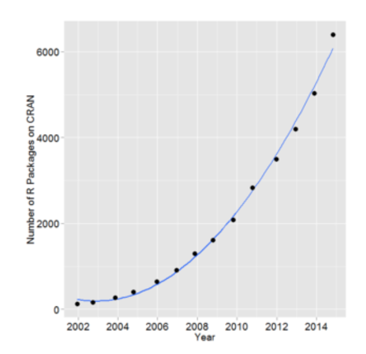
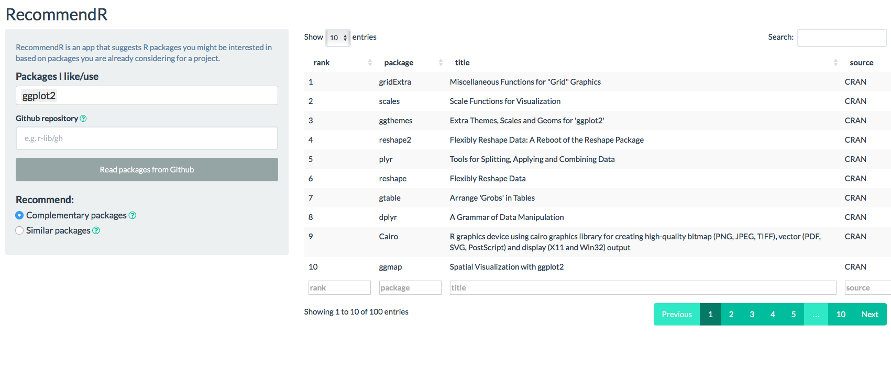
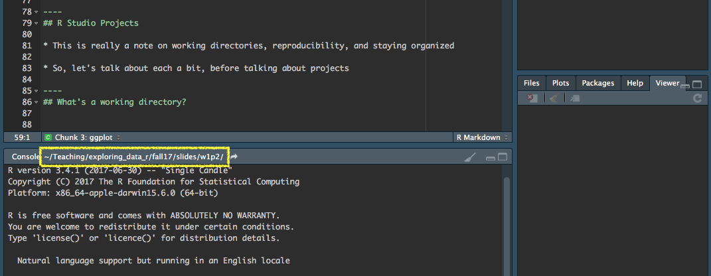

background-image: url(http://r4ds.had.co.nz/diagrams/data-science.png)
background-size:contain

# The data science pipeline

--
### How do we go about this?


---
class: inverse center middle
background-image: url(../img/sky.jpg)
background-size: cover

# R Packages

---
# "Out of the box" functionality

.pull-left[
### Some packages are *pre-loaded* 
* e.g.
	+ {base}
	+ {graphics}
	+ {stats}
]

.pull-right[
### Others are *pre-installed*
* e.g.
	+ {boot}
	+ {MASS}
	+ {Matrix}
]

---
# Pre-loaded vs installed

Pre-loaded packages work on launch. For example, `plot` is part of the {graphics} package, which ships with R.

```{r first_plot, fig.width = 12, fig.height = 5}
plot(x = 1:10, y = 1:10)
```

---
# {base} package

All functions come from a package! What do you get from the following?

.gray[.small[Those are backticks, which are at the top-left of your keyboard]]

```{r base, eval = FALSE}
?`+`
```

--
* Side note - any idea why we have to surround this with backticks?

--
* See [here](https://stackoverflow.com/questions/36220823/what-do-backticks-do-in-r) 

> A pair of backticks is a way to refer to names or combinations of symbols that are otherwise reserved or illegal


--

* Also relevant, backticks define code in markdown (which we'll learn more about later), so you may seem them in error messages to signify `'this bit is code'`


---
class: inverse center middle
background-image: url(../img/base.png)
background-size: contain

---
# Pre-installed packages
* Outside of the packages that are *pre-loaded*, there are a number that come *pre-installed*. e.g.,
  + {MASS}
  + {boot}
  + {cluster}
  + {lattice}

--

* Packages that are not pre-loaded require an explicit call to the `library` 

---
# Example with {MASS}
* Say we want to simulate data from a multivariate normal distribution

```{r first_lib}
# Set up simulation parameters
n_obs <- 1000
means <- c(100, 50) # `c` comes from base - used to create a vector
error_cv <- matrix(c(100, 44, # `matrix` comes from base
					     44, 49), byrow = TRUE, ncol = 2) 
cov2cor(error_cv) # part of stats package
```

---
# Simulation, continued

```{r sim}
library(MASS) # load the pre-installed package
sim <- mvrnorm(n = n_obs, mu = means, Sigma = error_cv)
head(sim) # print!
```

---
```{r sim_cor_plot, fig.width = 12}
plot(sim)
```

---
```{r check_sim_cor}
cor(sim)
```
<br>

### Overall takeaway
There is a *ton* of functionality that comes with R right from your initial download. But, the functionality can be extended further by installing other packages.

---
# Other packages

### On CRAN 
.pull-left[

]

.pull-right[
* Any of these can be installed with `install.packages("pkg_name")`. You will then have access to all the functionality of the package.
* Notice this plot only goes to **mid-2014**. As of this writing (09/19/2018),
there are [13,077](https://cran.r-project.org/web/packages/) packages available
on CRAN!
* Necessarily constantly evolving to keep up with the varied demands of data
  scientists within the data science pipeline.
]

---
# Other packages
### On GitHub
Generally these packages are more "in development", or are the beta versions of
existing packages. 

.pull-left[
<div align = "center">

</div>
]

.pull-right[
<div align = "center">

</div>
]

---
# Installing from GitHub

First, install the *devtools* package from CRAN

```{r install_devtools, eval = FALSE}
install.packages("devtools")
```

Next, load the *devtools* library to access the `install_github` function. For example, to install my *esvis* package

```{r install_r2Winsteps, eval = FALSE}
library(devtools)
install_github("datalorax/esvis")
```

---
You then have access to all the functionality of that package once you load it. Let's look at these data:

```{r load_data_esvis, echo = FALSE}
library(esvis)
library(ggplot2)
theme_set(theme_minimal())
knitr::kable(head(benchmarks), row.names = FALSE, format = "html")
```

---
# PP-Plot
```{r load_esvis, fig.width = 13, fig.height = 6.5}
library(esvis) 
pp_plot(benchmarks, reading ~ ell)
```

---
# Look at it by FRL eligibility
```{r byfrl, fig.width = 13, fig.height = 6.5}
pp_plot(benchmarks, reading ~ ell + frl)
```

---
# Binned quantile effect sizes
```{r esvis_ptile, fig.width = 13, fig.height = 7}
binned_plot(benchmarks, math ~ ethnicity, qtile_groups = 5)
```

---
# Probably overly complicated
```{r esvis_ptile2, fig.width = 13, fig.height = 6, warning = FALSE}
binned_plot(benchmarks, math ~ ethnicity + season + frl, 
            qtile_groups = 5)
```

---
# ES Calculation

```{r esvis_calcs}
hedg_g(benchmarks, 
       math ~ ethnicity + frl, 
       ref_group = ~White + `Non-FRL`)
```

---
# Is this exciting!?! YES!!!
Why is this such a big deal? 
* With just a basic knowledge of R you have access to literally thousands of packages
	+ Expanding on a daily basis
	+ Provides access to cutting edge and specialized functionality for analysis, data visualization, and data munging
	+ Some of the most modern thinking on data analysis topics are often represented in these packages

---
class: inverse center middle
background-image: url(../img/alberta.jpg)
background-size: cover

# A few examples of amazing packages

---
### First: the data

https://cepa.stanford.edu/seda/overview

```{r load_seda, include = FALSE}
library(tidyverse)
library(here)
library(fs)

seda <- read_csv(dir_ls(here("data"), regexp = "seda"))
seda <- seda %>% 
  mutate(grade = parse_number(grade),
         time  = grade - 3)

# select cohort
criteria <- data_frame(year = 2009:2013, grade = 3:7)
seda <- semi_join(seda, criteria) %>% 
  select(stateabb, leaname, grade, time, mean_link_ela, mean_link_math)
```

.gray[.small[(loaded from code not displayed)]]

```{r head_seda}
seda
```

---
# lme4
Let's fit a multilevel linear growth model for ELA

Question: How much does the progression from Grades 3-7 vary by state?

```{r lme4_demo, message = FALSE}
# install.packages("lme4")
library(lme4)

mlm <- lmer(mean_link_ela ~ 1 + time + 
				(1 + time|leaname) + 
				(1 + time|stateabb), 
			data = seda,
			REML = FALSE)
```

---
```{r smry_lme4_lin}
summary(mlm)
```

---
# Prettier output? Use a different package!

```{r pretty_lme4_output, eval = FALSE, warning = FALSE}
# install.packages("sjPlot")
library(sjPlot)
sjt.lmer(mlm, p.kr = FALSE) 
```
.gray[Note, the `p.kr` argument generally not necessary]

---

`r sjPlot::sjt.lmer(mlm, p.kr = FALSE, no.output = TRUE)$knitr`


---
# Quickly plot differences between states

```{r lme4_state_diff, results = "hide", fig.height = 5, fig.width = 12}
library(lattice) # pre-installed package
re <- ranef(mlm, condVar = TRUE)
qqmath(re)$stateabb
```

---
# Compare to a curvilinear model

```{r lme4_curv}
mlm_c <- lmer(mean_link_ela ~ 1 + poly(time, 2, raw = TRUE) +
				(1 + time|leaname) + 
				(1 + time|stateabb), 
			data = seda,
			REML = FALSE)
```

---
For more abbreviated (and essential) output

```{r mlm_c_smry_echo, eval = FALSE}
library(arm)
display(mlm_c, detail = TRUE)
```

```{r mlm_c_smry_eval, echo = FALSE}
arm::display(mlm_c, detail = TRUE)
```

---
# Compare models

```{r compare_mods}
anova(mlm, mlm_c)
```

---
class: inverse bottom center
background-image: url(https://i2.wp.com/miamicomedy.com/wp-content/uploads/2016/11/cb5fe4610ffe82b1c25288e1fb04b026.jpg?fit=640%2C353&ssl=1)
background-size: cover

.major-emph-green[Feeling overwhelmed?]

---
# There are tools to help!

http://recommendr.info



---
# There are people to help!


---
class: inverse bottom
background-image: url(https://myareanetwork-photos.s3.amazonaws.com/event_photos/f/258775_1495223084.png)
background-size: cover

.major-emph-green[You've got this!]

---
class: inverse center middle
background-image: url(https://cdn.iconscout.com/public/images/icon/premium/png-512/code-fork-3e7e53ac6a8c0a88-512x512.png)
background-size: cover

# Tools outside of R

---
# git and GitHub
### Why?

--

1. Open, transparent, and public science

--

1. Reproducibility

--

1. Collaborative tool

--
1. Version control .gray[.smaller[(usually listed as the first reason)]]

--
1. Let's [go explore](https://github.com) for a minute!

---
### How?

1. Create an account
1. Get a GUI and/or learn the command-line tools
  + I'm okay with either or both, as long as you (sort of) know what you're doing 
1. Develop a solid understanding of the underlying structure, so you know what you want to do, even if you don't know how
  + stage, commit, push, pull 
  
---
class: inverse
background-image: url(../img/cats.jpg)
background-size: cover

---
class: inverse
background-image: url(https://cdn-images-1.medium.com/max/500/0*L8V0he9CqczlGIhu.jpg)
background-size: cover

---
class: inverse
background-image: url(https://pics.me.me/merge-conflict-git-push-force-origin-masteremegenerator-net-29177974.png)
background-size: contain


---
class: inverse
background-image: url(http://m.memegen.com/d5mxnu.jpg)
background-size: contain

---
class: inverse
background-image: url(https://media.makeameme.org/created/you-said-you-ujn0c6.jpg)
background-size: contain

---
class: inverse middle center
# Enough memes?

---
# Overall message
git can obviously be frustrating .Large[**But**]:
* Super transparent - screw ups and all
* Can be a powerful tool for collaboration
  + Communication between team members still important
  + Try to avoid merge conflicts
      + One person working on one thing at a time
      + pull first each time
      + push often/at logical points - don't lax here


---
# Josh and I are on the same page

.center[

<blockquote class="twitter-tweet" data-lang="en"><p lang="en" dir="ltr">My 2cents on open science is less pre-reg, more:<br><br>git commit &#39;oops!&#39;<br>git commit &#39;fixed mistake&#39;<br>git push</p>&mdash; Joshua Rosenberg (@jrosenberg6432) <a href="https://twitter.com/jrosenberg6432/status/1020148533079486464?ref_src=twsrc%5Etfw">July 20, 2018</a></blockquote> <script async src="https://platform.twitter.com/widgets.js" charset="utf-8"></script> 

]

---
# But there's also this

.center[

<blockquote class="twitter-tweet" data-lang="en"><p lang="en" dir="ltr">That feeling when you&#39;re writing an <a href="https://twitter.com/hashtag/AERA19?src=hash&amp;ref_src=twsrc%5Etfw">#AERA19</a> presentation proposal on open science and it takes you four commits and a series of weird/confusing error messages to upload the final file to GitHub 😂</p>&mdash; Joshua Rosenberg (@jrosenberg6432) <a href="https://twitter.com/jrosenberg6432/status/1021385676472967168?ref_src=twsrc%5Etfw">July 23, 2018</a></blockquote> <script async src="https://platform.twitter.com/widgets.js" charset="utf-8"></script> 

]

---
# Last note
Best recipe for **open** and **transparent** research, from the perspective of
me:
* Use scripting
* Use dynamic documents 
  + R Markdown is the best 
    + Better than Jupyter notebooks imo; see [here](https://docs.google.com/presentation/d/1n2RlMdmv1p25Xy5thJUhkKGvjtV-dkAIsUXP-AL4ffI/edit#slide=id.g362da58057_0_1) and [here](https://yihui.name/en/2018/09/notebook-war/)
* Use git/GitHub
* Use open data whenever possible
  + Consider ways you can make portions of the data open, if not all of it
  + Consider methodologies you can use with open data that may recover the
    properties of protected data
* Advanced - use *packrat* or similar (e.g., *drake*) that stores software
  versions

---
class: inverse
background-image: url(../img/help.jpg)
background-size: cover

---
.center[


]

(I may have made these slides late at night)

---
# Getting started in earnest with R!

* Demo RStudio goodies
* Talk scripts for a minute
* Jump to lab

---
## R Studio
[demo]
* Customizing the look/feel 
  + Theme
  + Syntax highlighting
  + Panes
* Keyboard shortcuts
* Snippets (briefly)

---
## R Studio Projects
* Start a new project and call it Lab 1. 
* Once the Project has launched, create a new R script to save all your work for today. Run lines of code from the script with Command + Enter (mac) or Control + Enter (Windows). 

[demo]

<br>

* This is really a note on working directories, reproducibility, and staying organized
* So, let's talk about each a bit, before talking about projects

---
## What's a working directory?

* Where you're at on your computer.
* See where you're currently at by looking at the top of the console 
    + Or run `getwd()` in the console
* You can change your working directory, with `setwd("path/to/files/")` but I'm going to recomend avoiding that - instead, use projects.
* Use `list.files()` to see the contents of your working directory (i.e., what your computer "sees")

 

---
## What's different with projects?
* Your working directory is immediately wherever your project is.
* Use relative paths from there to read/save data (or the *here* package, 
  which we'll talk about more later).

---
## How do we access variables?
* Generally, in this course, *tidyverse* tools
* Sometimes `$`
* Let's load the tidyverse, and then we'll access some variables from the 
  datasets within some of those packages.
* Look at the *gss_cat* data frame.

```{r gss_cat, message = FALSE, warning = FALSE}
library(tidyverse)
gss_cat
```

---
# Selecting variables
Select the *race* variable with `$`.

```{r select_$}
gss_cat$race
```

---
## Look at the structure of an object

```{r str}
str(gss_cat)
```


---
## When `$`?
Quick and dirty

.pull-left[
```{r table}
table(gss_cat$race)
```

]

.pull-right[
```{r hist}
hist(gss_cat$age)
```
]

---
## Your turn
* Run `table` on *religion*
* Produce a histogram of *tvhours*

---
# The pipe operator
We'll talk about this a lot more, but
* The `%>%` operator (super + shift + m) inserts the input from the left as the 
  first argument in the next function
  
```{r pipe-example1}
gss_cat %>% 
  count(denom)
```

The above is equivalent to

```{r no-pipe-example}
count(gss_cat, denom)
```

---
# Why use `%>%`
* Chaining arguments

```{r chained-args}
gss_cat %>% 
  group_by(rincome) %>% 
  count(partyid) %>% 
  head(15)
```

---
```{r chained-args2, eval = FALSE}
gss_cat %>% 
  group_by(rincome) %>% 
  count(partyid) %>% 
  head(15)
```

The above is equivalent to the below, but the above is considerably more clear.

```{r chained-args3}
head(count(group_by(gss_cat, rincome), partyid), 15)
```

And this is a relatively simple example...

---
class: inverse center middle
# Independent Lab