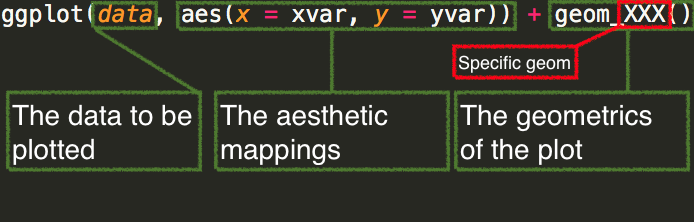
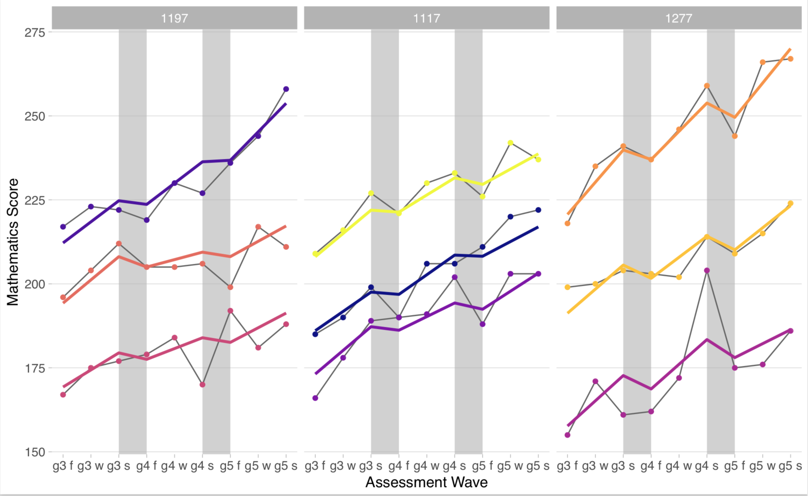

```{r, setup, include = FALSE}
knitr::opts_chunk$set(fig.width = 13, message = FALSE)
```

# Agenda 

* Introduce ggplot2
* Discuss scatterplots and smooths
* Discuss line plots
* Lab

---
# The *ggplot2* package
Today, we'll primarily be covering the basics of the *ggplot2* package.

<div align = "left">

</div>

---
# Part of the many reasons Hadley is a good human

<div align = "left">

</div>

(It's no longer there, but if you want access to it let me know)

---
##Other resources
The *ggplot2* package is one of the most popular R packages. There are a plethora of resources to learn the syntax. 

* Perhaps the most definitive, and indexes all the capabilities of ggplot2, along with multiple examples 
  + http://docs.ggplot2.org/current/index.html#

* RStudio cheat sheet can also be helpful
  + https://www.rstudio.com/wp-content/uploads/2015/03/ggplot2-cheatsheet.pdf

* R Graphics Cookbook
  + http://www.cookbook-r.com/Graphs/

---
# Components
Every *ggplot* plot has three components

1. data
  * The data used to produce the plot
2. aesthetic mappings
  * between variables and visual properties
3. layer(s)
  * usually through the `geom_*` function to produce geometric shape to be
  rendered

---
# Basic syntax



---
# Data for today

From ggplot: `mpg`
* Very similar to the *mtcars* data, but with more cases and a few more interesting variables

```{r mpgData}
library(ggplot2)
head(mpg)
```

---
# Setting up a plot

* Run the following. What do you see?

```{r mpgEx1, eval = FALSE}
ggplot(mpg, aes(x = displ, y = hwy)) 

```

---
# Plot setup

```{r mpgEx2, fig.height = 5.5}
ggplot(mpg, aes(x = displ, y = hwy)) 
```
* It's ready for you to add some layers... what do you want to add?

--
### How about points!

---
```{r mpgEx3}
ggplot(mpg, aes(x = displ, y = hwy)) +
  {{geom_point()}}
```

---
# Adding layers
* In the previous slide, we added a layer of points
* The `geom_point` layer is a function, complete with it's own arguments
* How do you think we might change the color of the points?

--

```{r mpgEx4-echo, eval = FALSE}
ggplot(mpg, aes(x = displ, y = hwy)) +
  geom_point(color = "magenta")
```

---
```{r mpgEx4-eval}
ggplot(mpg, aes(x = displ, y = hwy)) +
  geom_point(color = "magenta")
```

---
# Add another layer
* Let's add a smooth with `geom_smooth()`

--
```{r mpgEx5, message = FALSE, fig.height = 5.5}
ggplot(mpg, aes(x = displ, y = hwy)) +
  geom_point(color = "magenta") +
  {{geom_smooth()}}
```

---
# Global versus conditional coloring
* Prior examples changed colors globally
* Use `aes()` to access variables, and color **by** the specific variable

--
```{r mpgEx6, fig.height = 4}
ggplot(mpg, aes(x = displ, y = hwy)) +
  geom_point(aes(color = class)) 
```

---
# Conditional flow through layers
* If we use something like `color = x` in the main aesthetic, it will bleed
through to all other layers. 

--
* These two lines of code are the same

```{r conditional-flow1, eval = FALSE}
ggplot(mpg, aes(x = displ, y = hwy)) +
  geom_point(aes(color = class)) 

ggplot(mpg, aes(x = displ, y = hwy, color = class)) +
  geom_point()
```

--
* But these are not... why?

```{r conditional-flow2, eval = FALSE}
ggplot(mpg, aes(x = displ, y = hwy)) +
  geom_point(aes(color = class)) +
  geom_smooth()

ggplot(mpg, aes(x = displ, y = hwy, color = class)) +
  geom_point() +
  geom_smooth()
```

---
# Be careful with `aes()`
Using `aes` when you don't need it

```{r wrong-aes-usage1, fig.height = 5}
ggplot(mpg, aes(x = displ, y = hwy)) +
  geom_point(aes(color = "blue")) +
  geom_smooth()
```

---
# Be careful with `aes()`
Not using `aes` when you  need it

```{r wrong-aes-usage2, error = TRUE}
ggplot(mpg, aes(x = displ, y = hwy)) +
  geom_point(color = class) +
  geom_smooth()
```

---
# Challenge time
1. Start a new R project
1. Create a new script, save it as "lastname-lab2.R"
1. Load the *tidyverse*
1. Print the `msleep` dataset to see it's structure - it's within *ggplot2*.

### For each of the following, produce a separate plot
1. Plot the relation between `sleep_total` and `brainwt` (with brainwt as the
   DV). 
1. Overlay a smooth on the prior plot
1. Color the points by `vore`, but fit a single smooth
1. Fit separate smooths by `vore`, but with all points being gray
1. Omit the standard error of the smooths
1. Use `ylim` as an additional layer to restrict the y-axis to range from 0 to 5

---
# Let's talk themes
* The default is `theme_gray`.
  + I don't like it
* Check out th *ggthemes* package for a lot of alternative
* *ggplot2* also comes with some built in alternatives
  + `theme_minimal` is my favorite
* Check out the [`ggthemeassist`](https://github.com/calligross/ggthemeassist) add-in 

[demo `ggthemeassist`]

---
# Other themes worth checking out
* The [hrbrthemes](https://github.com/hrbrmstr/hrbrthemes) are nice (and the
  developer is not only great, but a very nice human)
* Consider [building your own theme](https://bookdown.org/rdpeng/RProgDA/building-a-new-theme.html)
* When in doubt, google around a bit. For example, [this one](https://rpubs.com/Koundy/71792) 
looks fairly decent that I found with about 7 seconds of searching

--
### Set themes globally
One of the first lines in many of my scripts is

```{r theme-set}
theme_set(theme_minimal())
```

---
# Get a little fancy
* You can use `geom_point` for more than one layer
* You can also use a different data source on a later
* Use these two properties to highlight points
  + Like maybe the 4 cylinder cars?

---
```{r fancy}
ggplot(mpg, aes(x = displ, y = hwy)) +
  geom_point(color = "gray80") +
  geom_point(data = dplyr::filter(mpg, cyl == 4), 
             color = "magenta") +
  geom_smooth(se = FALSE)
```

---
# Line plots
### Discussion first
* When should you use line plots instead of smooths?
* What are some good candidate data for line plots?

--
* Usually when time is involved

--
* One of my favorites - observed versus model-implied

---
# Example



---
# Classical example
* Time series plot w/the economics dataset

```{r print-economics}
economics
```

---
* How do you expect we'd fit a line plot to these data, showing the
unemployment rate over time?
### Try it out!

---

```{r timeseries1}
ggplot(economics, aes(date, unemploy)) +
  geom_line()
```

---
# Short challenge
* Try adding an additional geom_ribbon layer
  + set the ymin to 0 and the ymax to `unemploy`.
  + Change the fill of the ribbon to `"darkcyan"`
  + Add transparency through the `alpha` argument
* Change line color to "gray40"
* Alternate which layer comes first - do you notice a difference?

[then demo]

---
# Quickly
Axis labels

```{r axis-labs1, fig.height = 4}
ggplot(economics, aes(date, unemploy)) +
  geom_line() +
  labs(x = "Date", 
       y = "Unemployment Rate",
       title = "Unemployment Rate Over Time",
       subtitle = "This is some additional information")
```

---
# Last thing for today
### Faceting
* One of the most powerful features of ggplot, from my perspective
* Produce $n$ plots **by** a specific variable

--
```{r facet1, fig.height = 4}
ggplot(mpg, aes(displ, hwy)) +
  geom_point() +
  geom_smooth() +
  {{facet_wrap(~drv)}}
```

---
# Careful about `~`

```{r facet2, error = TRUE}
ggplot(mpg, aes(displ, hwy)) +
  geom_point() +
  geom_smooth() +
  {{facet_wrap(drv)}}
```

---
# Other features
To be covered more in the future
* Colors
* Legends
* Fills
* Other geoms
* Categorical data
* etc.

---
class: inverse center middle

# Lab


