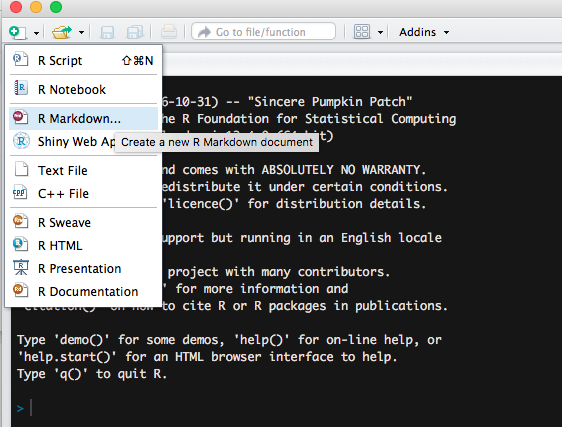
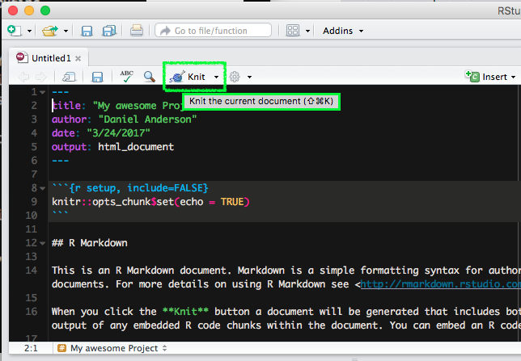
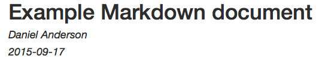
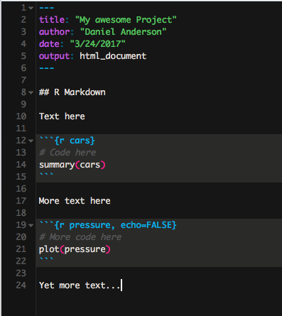
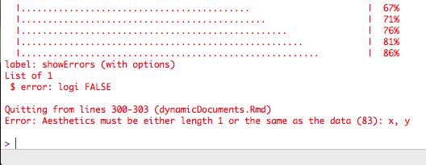
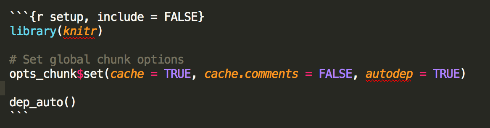
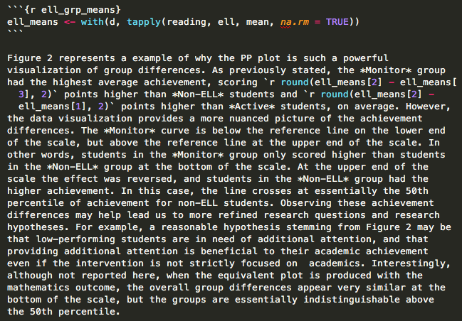

```{r, setup, include = FALSE}
knitr::opts_chunk$set(fig.width = 13, 
                      message = FALSE, 
                      warning = FALSE)
```

# Agenda 
* Questions
* R Markdown
* Lab


--
### Learning objectives for today
* Understand how to render R Markdown documents & mix code with text
* Understand different chunk options
* Understand inline code evaluation

---
class: inverse middle center
background-image:url(../img/chalkboard.jpg)
background-size:cover

# What questions do you have?

---
# R Markdown
From within your R Studio Project:


---
# First thing: Render!



---
# YAML Front Matter

```
---
title: Example Markdown document
author: Daniel Anderson
date: "2015-09-17"
---
```



* Three dashes before and after the YAML fields
* Case sensitive
* Many other fields are possible.
  + For example, you may want to include an `output:` argument (`pdf_document`,
    `html_document`, `word_document`). Must be specified as it is rendered, if
    not supplied.


---
# Code chunks versus text



---
# Code chunks

Start a code chunk with ` ```{r}`, then produce some r code, then close the

  chunk with three additional back ticks ` ``` `.


--

```{r add}
a <- 3
b <- 5

a + b * (exp(a)/b)
```


---
# Headings and Lists 
### Not R-lists

.pull-left[

```
# Level 1
## Level 2 
### Level 3 (etc.)
```

<br/>

```
 * Unordered list
  - inset
    + inset more
  - etc.

1. Ordered list
  a. blah blah
2. More stuff
```

]

.pull-right[


]


---
# Final Product

.pull-left[
<div >

</div>
]

.pull-right[
<div >

</div>
]


---
# More advanced options

* Chunk options
* Setting global options
* Inline code evaluation


---
# A few select chunk options

```{r chunkOptions1, echo = FALSE, results = "asis"}
library(knitr)
library(kableExtra)
ops <- c("eval", "echo", "results", "warning", "error", "message", "include", 
            "tidy", "cache", "cache.comments", "dependson", "autodep", "fig.height/fig.width", "fig.show", "interval")
args <- c("logical", "logical", "markup, asis, hold, hide", 
            "logical", "logical", "logical", "logical", "logical", 
            "logical, 0:3", "logical", 
            "char, num", "logical", "numeric",
            "asis, hold, animate, hide", "numeric")
default <- c("TRUE", "TRUE", "markup", "TRUE", "TRUE", "TRUE", "TRUE",
              "FALSE", "FALSE", "NULL", "NULL", "FALSE", "7, 7", "asis", "1")
result <- c("Evaluate the code?", "Show the code?", "Render the results",
              "Print warnings?", "Preserve errors? (if FALSE, quit)", 
              "Print any messages?",
              "Include any of the code or output or code?", 
              "Tidy code? (see formatR package)", "Cache code chunks?",
              "Cache invalidated by comment changes?",
              "Current chunk depend on prior cached chunks?",
              "Depends determined automatically? ",
              "Height and width of figure", 
              "How the figure should be displayed", 
              "Animate speed")
kable(data.frame(ops, args, default, result)[1:8, ], 
      col.names = c("Options", "Arguments", "Default", "Result"),
      format = "html") %>%
  kable_styling()
```

---
# (and a few more)

```{r chunkOptions2, echo = FALSE, results = "asis"}
knitr::kable(data.frame(ops, args, default, result)[9:15, ], 
  col.names = c("Options", "Arguments", "Default", "Result"))
```

.footnote[For complete documentation, see http://yihui.name/knitr/options/]

---
# echo and eval

.pull-left[

You can show code without evaluating it, using `eval = FALSE`. 

<div align = "left">

</div>


```{r rCalc2, eval = FALSE}
a + b * (exp(a)/b)
```
]

.pull-right[

Alternatively, you can evaluate the code without displaying it, using `echo = 
  FALSE`.

<div align = "left">

</div>

```{r plotExample, echo = FALSE, fig.width = 11}
data(mtcars)
with(mtcars, plot(mpg, hp, 
  xlab = "Miles Per Gallon", 
  ylab = "Horsepower",
  main = "Relation between Miles Per Gallon and Horsepower"))
```

]

---
# warning

```{r loadggplot, include = FALSE}
library(ggplot2)
theme_set(theme_minimal(base_size = 25))
```

### Warning = `FALSE`
```{r ggplotWarning2, warning = FALSE, fig.height = 5}
ggplot(msleep, aes(sleep_rem, sleep_total)) + 
  geom_point()
```
Warning is printed to the console when rendering.


---

### Warning = `TRUE`
```{r ggplotWarning1, fig.height = 6, warning = TRUE}
ggplot(msleep, aes(sleep_rem, sleep_total)) + 
  geom_point()
```

---
# Show errors

`error = TRUE`
```{r showErrors, fig.show = "hide", error = TRUE}
ggplot(msleep, aes(sleep, sleep_total)) + 
  geom_point()
```

--

<br>

If `error = FALSE`, the document won't render if it encounters an error.



---
# Message
Some functions will return messages. You may want to suppress these.

### message = `FALSE`
```{r messages2, message = FALSE, fig.height = 4}
ggplot(msleep, aes(sleep_total)) +
  geom_histogram()
```

---
# Message

### message = `TRUE`
```{r messages1, fig.height = 5, message = TRUE}
ggplot(msleep, aes(sleep_total)) +
  geom_histogram()
```

---
# include



The `include` argument is used to evaluate code that is not included in the
document at all. For example, when setting up your global options.


---
# Setting global options
Change the default behavior

```{r globalOps1, eval = FALSE}
opts_chunk$set(options)
```

For example, you can set `echo = FALSE` and `fig.width = 6.5` and `fig.height = 8` with the following code.

```{r globalOps2, eval = FALSE}
opts_chunk$set(echo = FALSE, fig.width = 6.5, fig.height = 8)
```

This is most useful when producing a report for somebody who doesn't use R and has no use or knowledge of the code.


You can always override the global options within a particular chunk, e.g.

` ```{r, chunkName, echo = TRUE}` 

` ``` `

---
## Other things to consider setting globally:
* `warnings = FALSE`
* `message = FALSE`
* `errors = TRUE`
* `echo = FALSE`
* Caching options (next slides)


---
# Inline code

A single back tick followed by `r` produces inline code to be evaluated.

<div align = "center">

</div>
<br>

This is an example of inline code, where I want to refer to the sum of `a` and
  `b`, which is `r a + b`.

This is *extremely* useful in writing reports. Never have to update any numbers in text, regardless of changes to your models or data (if you are careful about it).

---
# Real example




---
# Want to customize further?
The YAML will control a lot of how a document looks. For example, if you wanted to render with a different syntax highlighter:

.pull-left[
### Standard Rmd

```
---
title: "Doc Title"
output: pdf_document
---
```
]


.pull-right[
### kate 

```
---
title: "Doc Title"
output: 
  pdf_document:
    highlight: kate
---
```
]

---
# Last bit
### Formats
* R Markdown will render to HTML and PDF really well
  + Word kinda-sorta supported
  + You can also create websites, slides (like these), books, etc.

--
* Need a tex (pronounced tek) distribution
  + My recommendation for this class, and probs everything you'll ever need: 
    {tinytex}
    
--
```{r tinytex, eval = FALSE}
install.packages("tinytex")
tinytex::install_tinytex()
```

This is another amazing package by Yihui Xie. See more about it
[here](https://yihui.name/tinytex/)

---
# Full distributions
* MacTex: http://www.tug.org/mactex/
* MikTex: https://miktex.org/download
* TexLive: http://www.tug.org/texlive/


--
### Modify the YAML
Get the same document to render to different formats by modifying the YAML

```
output:
  pdf_document: 
    highlight: kate
  html_document: 
    highlight: tango
  word_document: default
```

---
class: inverse center middle
# Lab