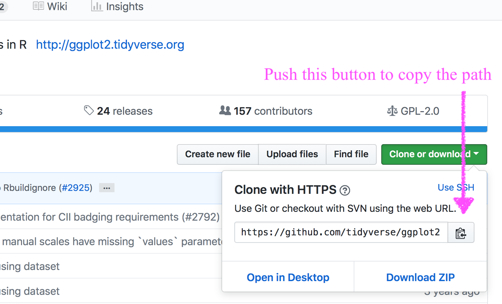
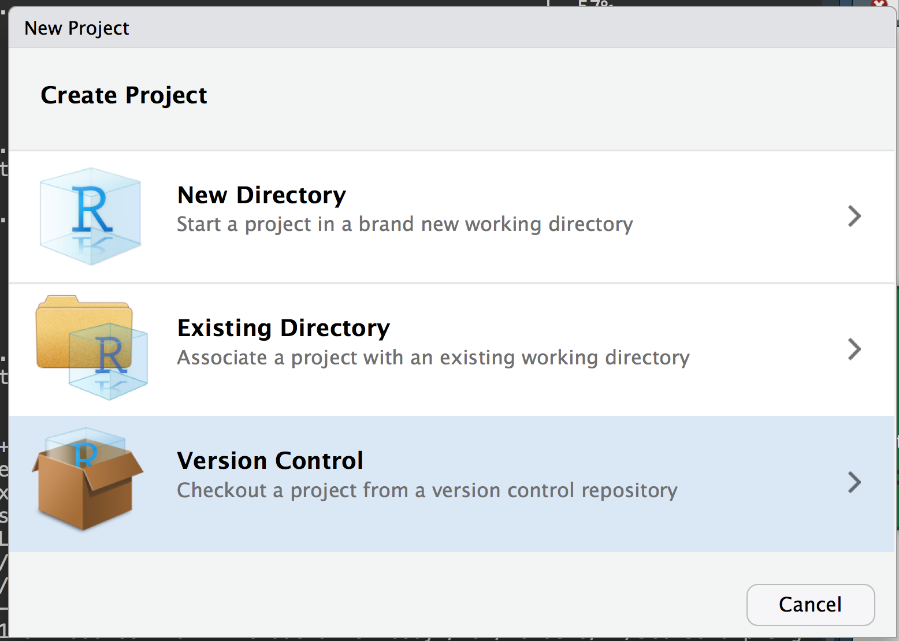
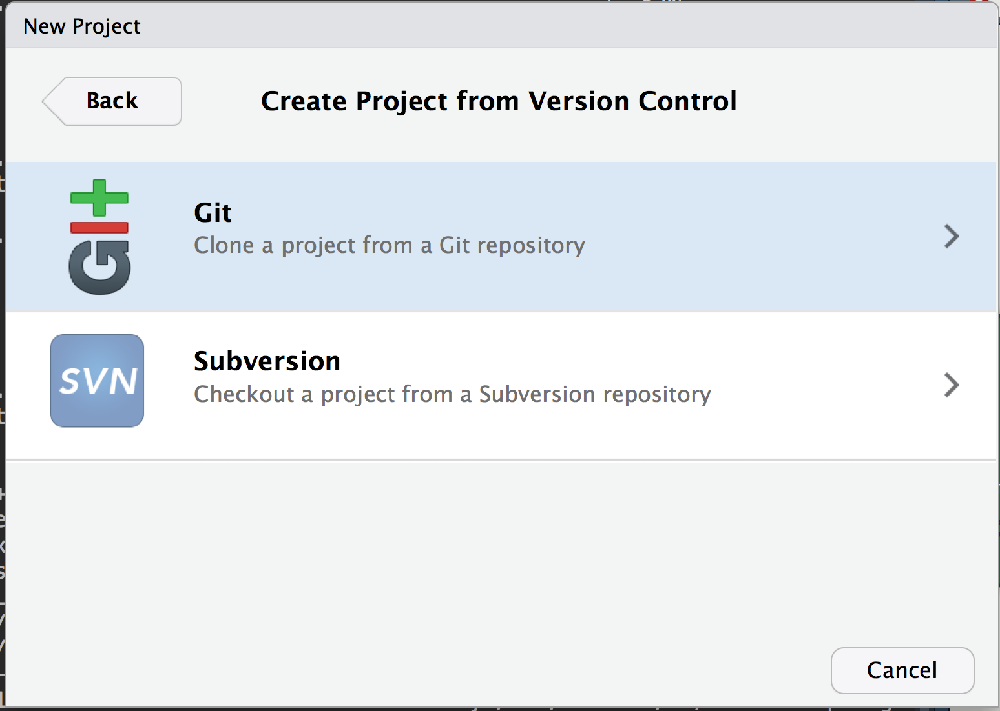
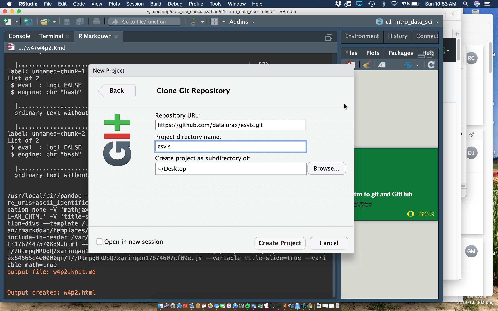
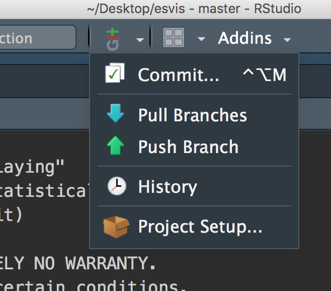
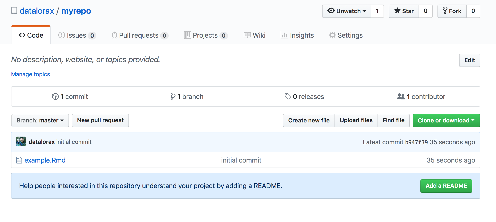
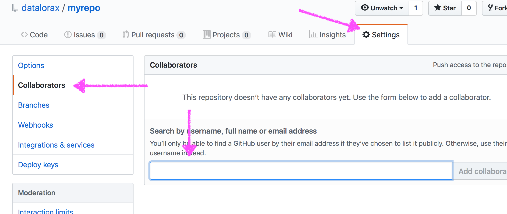
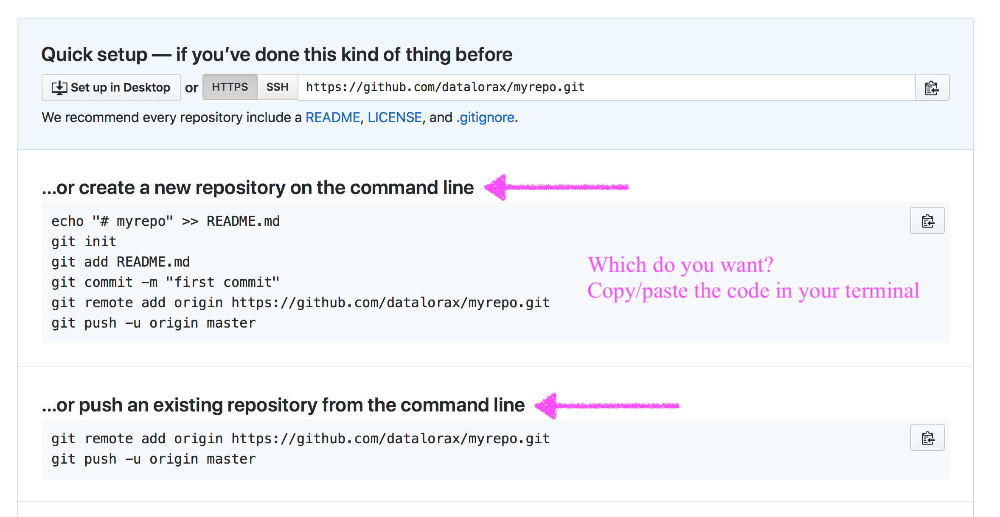

```{r, setup, include = FALSE}
knitr::opts_chunk$set(fig.width = 13, 
                      message = FALSE, 
                      warning = FALSE)
```

# Agenda 
* Questions
* Intro to *git*/*GitHub*
* Lab


--
### Learning objectives for today
* Understand the basics of git and git vocabulary
* Be able to create repos, push projects, commit changes
* Begin collaborating on a project

---
class: inverse middle center
background-image:url(../img/chalkboard.jpg)
background-size:cover

# What questions do you have?


---
class: inverse middle
background-image:url(../img/final-doc.png)
background-size:contain

.footnote[“Piled Higher and Deeper” by Jorge Cham, http://www.phdcomics.com]


---
### From swcarpentry


We can think of the changes as separate from the document

---


This means there are many possible versions of the same document

---


Unless there are conflicts, two changes from the same document can be merged
together

---
# How?
That's what we'll talk about today!

--

Goals: 
* Get you to understand the structure of git
* Actual method of completing the tasks is up to you
  + GUI? Command line? RStudio?

--
* If you go with a GUI, I'd recommend [GitKraken](https://www.gitkraken.com)
  + In fact, I'd recommend everybody download/use it, even if for merge
    conflicts alone.

---
# Some basic terminology
* Version Control System
  + A tool to help us track changes. *git* is one such system (but there
    are others).
--
* Commit
  + Changes that have been made to the file(s)

--
* Repository (repo)
  + The files, full commit history, and associated metadata for a project


--
### When working with git
* Each collaborator has the *entire* repo on their local machine
* There is also a cloud-based server hosing the repo (that's GitHub)
* The online version of the repo is call the *remote*

---
# Some key points

* Because *git* tracks the **entire** history of a project it is akin to
  unlimited "undo"
* *git* allows many people to work in parallel

---
# Creating a repository

* A couple of different options...


--
### Rstudio
Let's focus on the RStudio version first. 

---
# GitHub
Go to GitHub
* Select drop down by your profile, then "New Repository"
* I'd suggest also adding the R .gitignore and a README

<div >

</div>


---
# Name it

<div >

</div>


---
# Copy path



---
### Create a new RStudio Project



---



---



---



---
class: inverse center middle

# [demo]

Let's look atthe git plugin

---
# Tracking

Notice the hidden `.git` folder


--
On mac, show hidden files with

```
cmd + shift + .
```

(Note, I have hidden files shown all the time)

--

* As long as that folder exists, the **entire** folder will be
tracked.
  + **Do not create repos inside of repos**
  + If you want a folder to show up, there needs to be something in it (e.g., 
    a `README.md`)


---
# Ignoring Files
* When we initialized the repo, we started it with a `.gitignore` file
* The `.gitignore` file tells the repo not to track certain files
  + e.g., proprietary data


--
Probably not super important for now, but if you need to ignore a file in your repo for whatever reason, just put the name of the file in the `.gitignore` 


---
# Adding a file
* Let's create an R Markdown file and put it in our repo.
* Open terminal, type `git status`. What do you see?
* Use the RStudio `git` plugin. What do you see?

---
# Staging
* When you add files to a repo you are *staging* them for tracking.

[demo gitkraken & RStudio staging]


--
Command line version is `git add <file>`

---
# Commits
After staging, you *commit* changes to the file


---
# Push
After you've committed the changes you want, push them to the remote

--


Wait what's a remote again?


--
The cloud-based repo

---
# Refresh the repo



---
class: inverse right
background-image:url(../img/gitkraken.png)
background-size:cover

# gitkraken approach

---
# An overall view


---
# Revisiting some vocabulary
* stage
* commit
* push
* pull
* clone


--
At least half the difficulty with *git* is all the weird words

---
### Simple git through command line

90% of your workflow requires just a few commands.

* `git clone <path>`
  + Used once - gets the remote repo on your local.

--
* `git pull`
  + First command each time - syncs your local repo with the remote

--
* `git add`
  + Stages files in your local repo to be tracked

--
* `git commit <file> -m "my commit message"`
  + Commits changes to files in the repository, along with a commit message

--
* `git push`
  + Pushes the changes you've made from your local repo to the remote

--
* `git status`
  + Gives you an update on your local repo (what files still need to be added, 
    what changes have been made since last commit, etc.)

---
# Collaborating
Need to get proper permissions. Two methods:
* Add users to a repo: Settings => Collaborators => add user w/ username




---
# Collaborating
Second method: 
* Create an organization

<div >

</div>

---
# Cloning
Means you're downloading the repo

--
* Can also start a new RStudio project

--

```{bash, eval = FALSE}
git clone <path>
```

<div >

</div>

---
# Merge conflicts
* Remember to always `git pull` first
* Let's create a merge conflict!

(Note the GUI from *gitkraken* is really nice for resolving them)

---
# Merge conflict activity
1. Get a partner
1. Partner1 add Partner2 as a collaborator
1. Partner2 clone the repo
1. Partner1 make changes to the file in the repo, commit, and push
1. Partner2 make different changes to the same parts of the file. Commit the changes. Try to push. What happens? Why?
1. Open up the files - do you see some weird stuff that's been added?

### Wait for next steps

---
class: inverse middle center

## Merge conflicts w/gitkraken

<iframe width="560" height="315" src="https://www.youtube.com/embed/R1iWJNyRpQE" frameborder="0" allow="autoplay; encrypted-media" allowfullscreen></iframe>

---
# Some takeaways
Basic workflow is
* Create a repo
* Add collaborators
* Add files
* Commit changes
* Push changes to remote

---
# Advice on avoiding merge conflicts
* Always `git pull` (or the GUI equivalent) before you start working
* Try to stay in communication and don't work on the **exact** same thing at the same time
* Use a GUI to help you manage what merge conflicts you do run into

---
# Remember, today is an intro
We'll talk more about other `git` features later
* branching
* forking
* pull requests
* filing issues
* etc.

---
# Lab
* For lab today, just submit a link to the repo you created
* If we still have time, work with your group to get a shared repo
  + Discuss organization
  + Maybe get your outline uploaded?
* Chat with me before you leave if you're still confused (note, I expect you to
  be at least a little confused)

---
# Additional info

* Initializing a local repo through the command line

```{bash, eval = FALSE}
mkdir newrepo
cd newrepo
git init
```

--
You should get a message similar to 
`Initialized empty Git repository in /Users/Daniel/newrepo/.git/`


---
# Name it
Doesn't have to be the same name as the folder on your local, but probably a
good idea.

<div >

</div>

---
# Connect it



