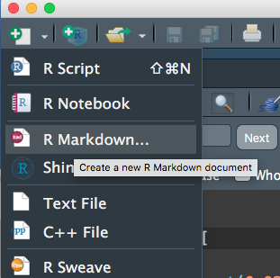
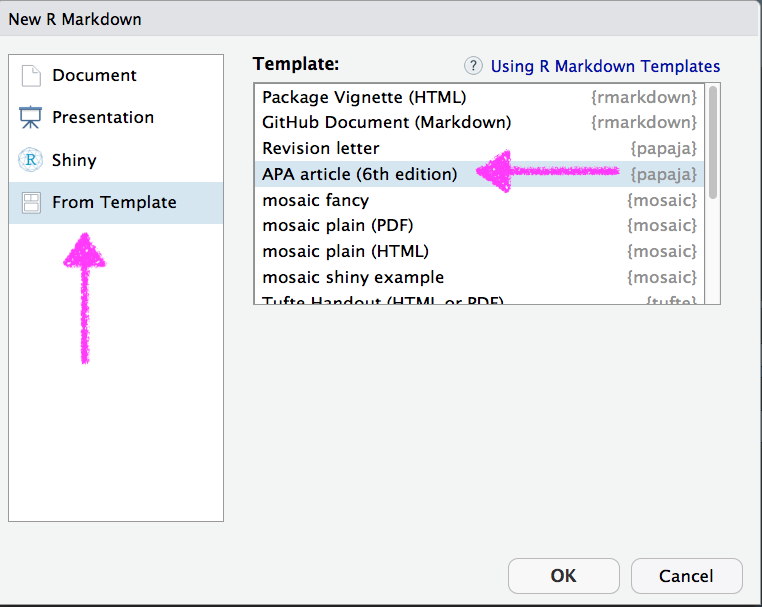
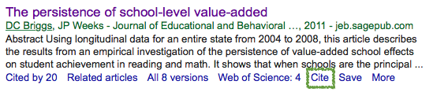
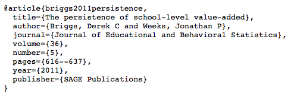
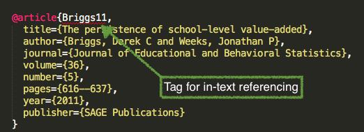
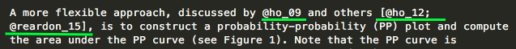
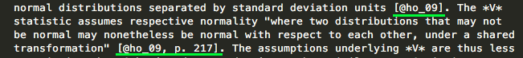
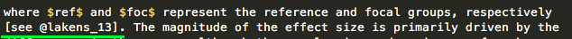
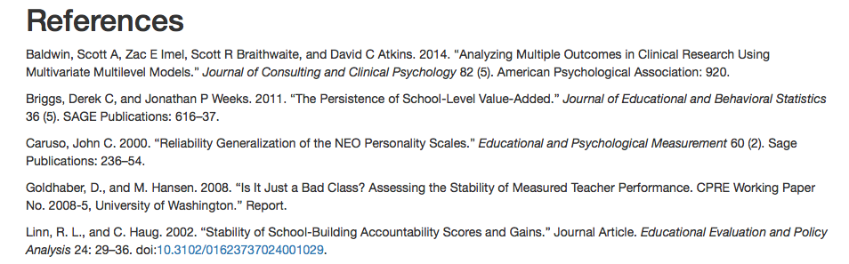

```{r, setup, include = FALSE}
knitr::opts_chunk$set(fig.width = 13, 
                      message = FALSE, 
                      warning = FALSE)
```

# Agenda 
* Questions
* Revisit some *git*/*GitHub*
* {papaja}
* Lab


--
### Learning objectives for today
* Understand how to render R Markdown documents into APA manuscripts
* Understand how to include citations in an R Markdown document


--
### Objectives
* Render an R Markdown document as an APA manuscript

---
class: inverse middle center
background-image:url(../img/chalkboard.jpg)
background-size:cover

# What questions do you have?


---
# Revisiting *git*
Talk with neighbor. What do these terms mean?

* clone
* pull
* stage
* commit
* push
* repo
* remote

---
class: inverse middle 
background-image:url(../img/wood.jpg)
background-size:cover

# [demo]
### I will
* Create a repo
* Clone into an R Project
* Create a file - stage, commit, push

### You then
* Clone the repo
* We'll have one person make a change
* Everybody .green[git pull] and see the changes
* Purposefully create a merge conflict, use gitkraken to deal with it.


---
# {papaja}

Despite having been around for  about 4 years 
[{papaja}](https://github.com/crsh/papaja) is still not on CRAN. 

More evidence that some of the best packages are not on CRAN.


--
Install with devtools

```{r install, eval = FALSE}
devtools::install_github("crsh/papaja")
```

---
# WIP

The package is seemingly perpetually under development. What does this mean?

--
* Re-install regularly.

--
* Not everything may work perfect - don't worry though, most things do

--
* You may want to peruse the current [issues](https://github.com/crsh/papaja/issues)
  + If you run into one (and you're sure it's an issue) consider opening one
  yourself
  + Bonus - the developer is very kind, so even if you open up a silly 
  issue, he's likely to be understanding

---
# Use the template

.pull-left[

]

.pull-right[

]

---
# YAML
A few more options than the default

<div>

</div>


---
# First thing - Render!

<div>

</div>

---
# Modifications
* Obvious ones
  + title
  + author & author info
  + abstract
  + keywords

--
* Less obvious
  + `shorttitle` (running head)
  + `authornote` (can fully delete or modify)
  + `wordcount` (fairly useless at this point imo)
  + `bibliography` (we'll talk more about this momentarily)
  + `linenumbers`
  + floats 
  + mask (for blind peer-review)
  + `classoption`

---
# Let's play for a minute!
Modify some of the options on the previous slide. 

Specifically, try changing `classoption` from `man` to `jou`. Try other things
too.


---
class: inverse middle center
# Citations

---
## Citations
To include references in your paper, you must:
* Create an external .bib file using LaTeX formatting (we'll get to this)
* Include `bibliography: nameOfYourBibFile.bib` in your YAML front matter.
* Refer to the citations in text using `@`

---
# Creating a .bib doc



--
<div>

</div>


---


--




---
# In text citations

```{r inTextCitesTable, echo = FALSE}
style <- c("@Briggs11", "[see @Baldwin2014; @Caruso2000]", "[@Linn02, p. 9]", 
          "[-@Goldhaber08]")
out <- c("Briggs and Weeks (2011)", "(see Baldwin et al. 2014; Caruso 2000)",
         "(Linn and Haug 2002, 9)", "(2008)")
knitr::kable(data.frame(style, out), 
        col.names = c("Citation Style", "Output"),
        format = "html")
```
<br>

Note this is not APA. However, references are included automatically at the end of the document. Include `# References` as the last line of your document to give it a title.

---
## A few real examples




---
## References


---
## Let's try!
[demo first]
* Open R Studio
    + Open a new Rmd document
* In your YAML, add a new line for `bibliography:`. Follow this with the name of your bibliography file, which should be in the same directory, and should be the bare name (not in quotes).
* Open a text file, save it with a `.bib` extension.
* Go to google Scholar and find a reference to cite. Copy and paste the citation into your .bib file using google's cite option.
* Include a reference to the citation in your Rmd file and render it. Include a page break so your citations are on a separate page.

---
## Other potential option
* Add a GUI-like interface with *citr* 
    + written by the same author who wrote the APA R Markdown documentation

See [here](https://github.com/crsh/citr)

---
# Tables
Not my favorite thing - figures generally better.

Some options
* `papaja::apa_table` for basic APA tables
* `knitr::kable` for basic tables of any sort
  + Use [{kableExtra}](https://github.com/haozhu233/kableExtra) for extensions 
  (see [here](https://haozhu233.github.io/kableExtra/awesome_table_in_html.html)
  for extensions in html and
  [here](https://haozhu233.github.io/kableExtra/awesome_table_in_pdf.pdf) for
  extensions in pdf)
* [{huxtable}](https://github.com/hughjonesd/huxtable)

---
# Chunk options
For tables, you may have to specify `results = "asis"` or you can end up with
something like 

```{r echo = FALSE}
papaja::apa_table(mtcars)
```

---
# Careful on formats
* Make sure you specify the format you want
  + PDF or HTML?


--
From `?kable`
* `format = "latex"` for PDF
* `format = "html"` for HTML output

---
# Things to cover still
* equations
* extending options a bit

---
class: inverse center middle
# Lab
