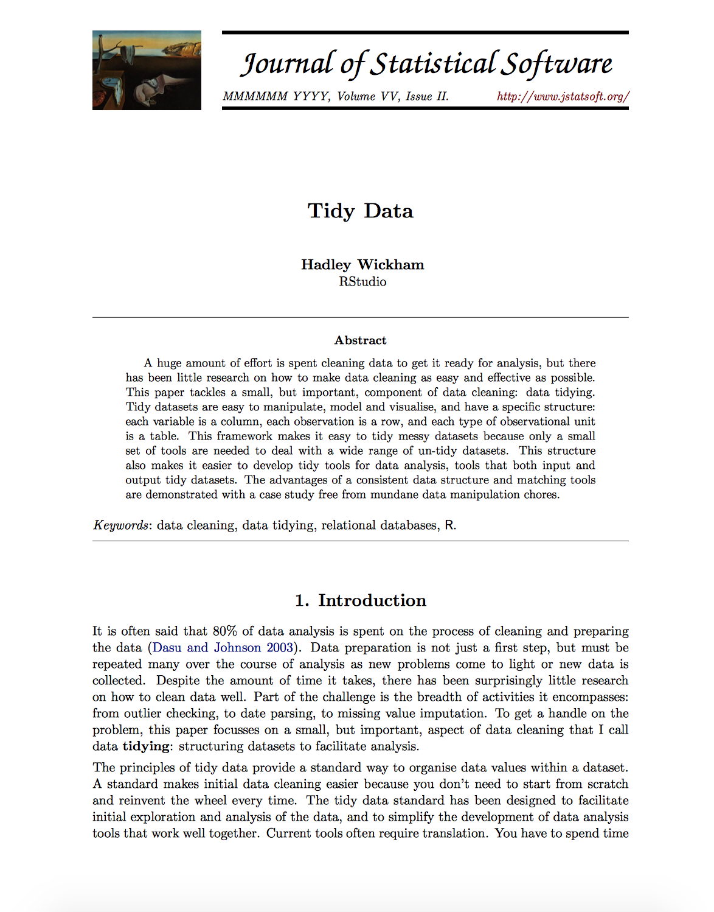
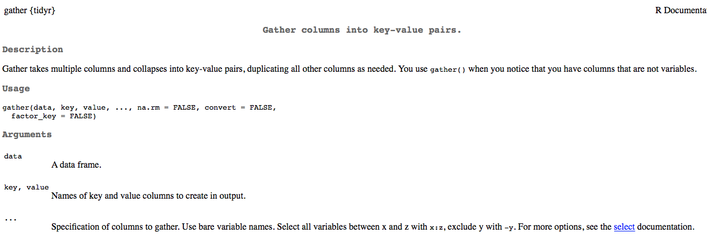

```{r, setup, include = FALSE}
library(knitr)
opts_chunk$set(fig.width = 13, 
               message = FALSE,
               warning = FALSE)
library(tidyverse)
theme_set(theme_minimal(base_size = 25))
```

# Agenda 
* Introduce the concept of tidy data
* Tidy a simple dataset together with `tidyr`
* Summarize and transform tidy data with `dplyr`
* Lab


--
### Learning objectives for today
* Understand the concept of tidy data is useful
* Understand and be able to apply the `gather` function


---
class: inverse middle center
background-image:url(../img/chalkboard.jpg)
background-size:cover

# What questions do you have?


---
# Revisiting *git*
Talk with neighbor. What do these terms mean?

* clone
* pull
* stage
* commit
* push
* repo
* remote


---
class: inverse center middle
> It is often said that 80% of data analysis is spent on the process of cleaning and preparing the data.

\-Hadley Wickham

---
class: middle

.pull-left[

* Persistent and varied challenge
* Little research on how to do it well
  + Enter Hadley 
]


.pull-right[



]

---
# Tidy data

### Definition
1. Each variable is a column
2. Each observation is a row
3. Each type of observational unit forms a table

--

.myblue[We won't talk about 3 so much...]


---
# Common ways data are "messy"
* Column headers are values, not variable names
* Multiple variables stored in one column
* Variables are stored in both rows and columns

---
# Some examples
.gray[(from the JSS paper)]

```{r religion_no_show, echo = FALSE, warning = FALSE, message = FALSE}
#### Note: Code below is Hadley's with very subtle tweaks
####   (see https://github.com/hadley/tidy-data/blob/master/data/pew.r)
library(tidyverse)
library(here)
pew <- foreign::read.spss(here("data", "pew.sav"))
pew <- as.data.frame(pew)

religion <- pew[c("q16", "reltrad", "income")]
religion$reltrad <- as.character(religion$reltrad)
religion$reltrad <- str_replace(religion$reltrad, " Churches", "")
religion$reltrad <- str_replace(religion$reltrad, " Protestant", " Prot")
religion$reltrad[religion$q16 == " Atheist (do not believe in God) "] <- "Atheist"
religion$reltrad[religion$q16 == " Agnostic (not sure if there is a God) "] <- "Agnostic"
religion$reltrad <- str_trim(religion$reltrad)
religion$reltrad <- str_replace_all(religion$reltrad, " \\(.*?\\)", "")

religion$income <- c("Less than $10,000" = "<$10k", 
  "10 to under $20,000" = "$10-20k", 
  "20 to under $30,000" = "$20-30k", 
  "30 to under $40,000" = "$30-40k", 
  "40 to under $50,000" = "$40-50k", 
  "50 to under $75,000" = "$50-75k",
  "75 to under $100,000" = "$75-100k", 
  "100 to under $150,000" = "$100-150k", 
  "$150,000 or more" = ">150k", 
  "Don't know/Refused (VOL)" = "Don't know/refused")[religion$income]

religion$income <- factor(religion$income, levels = c("<$10k", "$10-20k", "$20-30k", "$30-40k", "$40-50k", "$50-75k", 
  "$75-100k", "$100-150k", ">150k", "Don't know/refused"))
counts <- plyr::count(religion, c("reltrad", "income")) %>% 
  tbl_df()
names(counts)[1] <- "religion"

raw <- reshape2::dcast(counts, religion ~ income) %>%
  tbl_df()
print(raw, n = 10)
```

---
# The tidied version

```{r tidy_religion, echo = FALSE}
print(counts, n = 12)
```

---
# Yet another example

```{r echo = FALSE}
## Hadley's code, again
raw <- read_csv(here("data", "tb.csv"))
raw$new_sp <- NULL
raw <- subset(raw, year == 2000)
names(raw)[1] <- "country"

names(raw) <- str_replace(names(raw), "new_sp_", "")
raw$m04 <- NULL
raw$m514 <- NULL
raw$f04 <- NULL
raw$f514 <- NULL
###

raw[1:10, c(1:7, 10:15)]

```

In this example, *M* indicates if the data came from a male, while *F* indicates female. The subsequent numbers represent the age range. Tidying these data will be a two step process.

---
## Step one

```{r step_one, echo = FALSE}
partial <- raw %>%
  dplyr::select(-mu, -fu) %>%  
  gather(variable, cases, -country:-year) 

partial
```
Notice this is much closer to what we want, but we have a problem now in that we have **two variables stored in one column**.

---
## Step two: Tidied data

```{r step_two, echo = FALSE}
tidied2 <- partial %>% 
  separate(variable, c("sex", "age_range"), 1) %>% 
  mutate(age_range = recode(age_range, 
                    "014" = "0-14", "1524" = "15-24", "2534" = "25-34",
                    "3544" = "35-44", "4554" = "45-54", "5564" = "55-64",
                    "65" = "65+")) %>% 
  arrange(country) %>% 
  na.omit()

tidied2
```

---
## Variables as rows and columns

```{r weather_raw, echo = FALSE}
##### code written by Hadley
source(here("weeks", "w6", "hadley-scripts", "read-fwf.r"))

# Define format for fixed width file
cols <- data.frame(
  name =  c("id", "year", "month", "element"),
  start = c(1,     12,    16,      18),
  end =   c(11,    15,    17,      21),
  stringsAsFactors = FALSE)

names <- str_c(c("value", "mflag", "qflag", "sflag"), rep(1:31, each = 4), sep = "_")
starts <- cumsum(c(22, rep(c(5, 1, 1, 1), 31)))
starts <- starts[-length(starts)]
ends <- c(starts[-1], starts[length(starts)] + 1) - 1

values <- data.frame(name = names, start = starts, end = ends,
                     stringsAsFactors = FALSE)
cols <- rbind(cols, values)

# Load data and subset to small example
raw2 <- read.fwf2(here("data", "weather.txt"),  cols)
raw2 <- subset(raw2, year == 2010 & element %in% c("TMIN", "TMAX")) 
raw2 <- raw2[, c(1:4, which(str_detect(names(raw2), "value")))]
raw2$id <- str_c(str_sub(raw2$id, 1, 2), 
              str_sub(raw2$id, -5, -1))

names(raw2)[-(1:4)] <- str_c("d", 1:31)
raw2[raw2 == -9999] <- NA
raw2[-(1:4)] <- raw2[-(1:4)] / 10 
rownames(raw2) <- NULL
raw2$element <- tolower(raw2$element)
####

tbl_df(raw2)
```

---
## Two Steps

```{r tidied_weather, echo = FALSE}
molten_weather <- raw2 %>% 
  as_data_frame() %>% 
  gather(day_key, value, d1:d31) %>% 
  na.omit()

tidied_weather <- raw2 %>% 
  as_data_frame() %>% 
  gather(day_key, value, d1:d31) %>% 
  spread(element, value) %>% 
  separate(day_key, c("discard", "day"), 1, convert = TRUE) %>% 
  mutate(month = str_pad(month, 2, "left", 0),
         day = str_pad(month, 2, "left", 0)) %>% 
  unite(date, year, month, day, sep = "-") %>% 
  select(-discard) %>% 
  arrange(id) %>% 
  na.omit()
```

### Step 1
```{r print_molten_weather, echo = FALSE}
molten_weather
```


---
### Step 2
```{r print_tidied_weather, echo = FALSE}
tbl_df(tidied_weather)
```


---
# Defining tidy data 
### (slightly differently)
Two rules essentially define tidy data<sup>1</sup>

.footnote[1\. [From Modern Data Science with R](https://mdsr-book.github.io)]

1. Each row is a case representing the same underlying attribute.
2. Each column is a variable containing the same type of value for each case. 

--

The combination of rows and columns make each case (row) unique, even though cells may be repeated many times (e.g., student identifier).

---
# Other formats
* There are many reasons why you might want to have "messy" data. However, tidy data is an extremely useful format generally, and particularly useful when applying tools within the *tidyverse*. 

* All packages within the tidyverse are designed to either help you get your data in a tidy format, or assume your data are already in a tidy format.

* Assuming a common data format leads to large jumps in efficiency, as the output from certain functions can be directly input into others.

---
class: inverse middle
background-image:url(../img/data-science.png)
background-size:contain

<br/>

<br/>

<br/>

<br/>

<br/>

<br/>

<br/>

<br/>

<br/>

## tidyverse data analysis philosophy


---
# Load the data
Let's look at the **exam1.csv** data

```{r load_data_echo}
library(tidyverse)
library(rio)
library(here)
d <- import(here("data", "exam1.csv"),
            setclass = "tbl_df")
```

---
# Pop Quiz Time
* Are these data tidy?
* If not, what needs to happen to make them tidy?
* What are the variables? What are the values?

```{r print-items, echo = FALSE}
d
```

---
# {dplyr} versus {tidyr}

<br/>

<br/>

<br/>


--

.pull-left[
### {dplyr}
Helps you manipulate your data (create, remove, summarize, etc. )
]


--

.pull-right[
### {tidyr} 
Helps you get your data into a tidy format
]

---
# Verbs: `tidyr`
* `gather()`
* `spread()`
* `separate()` and `extract()`
* `unite()`
* `nest()`

What do you think each do?


---
## Step 1: `gather` the item variables
* Change all item variables into two variables: `item` and `score`

<br>




---
class: 
background-image:url(../img/gather.png)
background-size:contain

### How does `gather` work?

---
Try running the following code

```{r gather_exam1, eval = FALSE}
d %>% 
  gather(key = item, value = score, -1:-2) 
```

* Third argument to `...` says we want to omit the first and second columns in when gathering.

<br>

What do you get? Are these data tidy now?

---
* The code on the previous slide basically puts our data in a tidy format. 
* To "clean up" some, could transform the `item` variable to numeric

```{r gather_exam1-print, echo = FALSE}
d %>% 
  gather(key = item, value = score, -1:-2) 
```

---
# Finish tidying the data

```{r full_tidy_exam1}
td <- d %>% 
  gather(item, score, -1:-2) %>% 
  mutate(item = parse_number(item))
```

* `parse_number()` comes from the *readr* package.

```{r print_tidy_data}
head(td)
```

---
# An alternative
(please run this code, following the explanation)

```{r full_tidy_exam2}
td <- d %>% 
  gather(item, score, -1:-2) %>% 
  separate(item, c("discard", "item"), sep = "_") %>% 
  select(-discard)
```

---
# Why are tidy data useful?
* When used in conjunction with `dplyr`, tidy data can result in large gains in efficiency.

For example, suppose we want to calculate the proportion of students responding correctly to each item.

```{r prop_correct_echo1, eval = FALSE}
td %>% 
  group_by(item) %>% 
  summarize(prop = mean(score))
```

---
```{r prop_correct_eval, echo = FALSE}
td %>% 
  group_by(item) %>% 
  summarize(prop = mean(score))
```

---
What if we also wanted to know the standard deviation?

```{r prop_correct_sd}
td %>% 
  group_by(item) %>% 
  summarize(prop = mean(score),
            sd = sd(score))
```
---
What if we wanted to know the proportion correct for each item by gender?

```{r prop_correct_by_gender}
td %>% 
  group_by(item, gender) %>% 
  summarize(prop = mean(score))
```

---
We can take the previous example further, by piping the output into a plot

```{r prop_correct_by_gender_plot, fig.height = 5}  
td %>% 
  group_by(item, gender) %>% 
  summarize(prop = mean(score)) %>% 
  mutate(gender = as.factor(gender)) %>% 
  ggplot(aes(x = item, y = prop, color = gender)) +
  geom_point(size = 2) +
  geom_line(aes(group = item))
```


---
But, probably better (clearer) to do it in two steps. 
<br>

First produce the data

```{r prop_correct_by_gender_plot_data}
pd <- td %>% 
  group_by(item, gender) %>% 
  summarize(prop = mean(score)) %>% 
  mutate(gender = as.factor(gender))
```
Then produce the plot

```{r prop_correct_by_gender_plot2, eval = FALSE}
ggplot(pd, aes(x = item, y = prop, color = gender)) +
  geom_point() +
  geom_line(aes(group = item))
```

---
# Challenge 

Remember, the following code calculates the mean score for each item. 

```{r prop_correct_echo2, eval = FALSE}
td %>% 
  group_by(item) %>% 
  summarize(prop = mean(score))
```

* Try to modify the above code to produce raw scores for every student. 
* If you're successful, try to also calculate the percent correct.

---
# Calculate Raw Scores
Modify the prior code to:
* `group_by` *stu_name* (rather than *item*)
* `sum` score (rather than average it with `mean`)

```{r raw_scores}
td %>% 
  group_by(stu_name) %>% 
  summarize(raw_score = sum(score))
```

---
class: inverse middle center
# Lab
