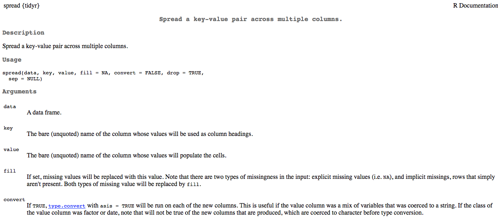

```{r, setup, include = FALSE}
library(knitr)
opts_chunk$set(fig.width = 13, 
               message = FALSE,
               warning = FALSE)
library(tidyverse)
theme_set(theme_minimal(base_size = 25))
```

# Agenda 
* Review tidy data
* Cover a few more examples together
* Lab
  + Work through Alison tidy data lab (based on Jenny Bryan's LOTR tidy data example)


--
### Learning objectives for today
* Get more comfortable with tidy data 
* Get more fluent with `gather`

---
class: inverse middle center
background-image:url(../img/chalkboard.jpg)
background-size:cover

# What questions do you have?


---
# Revisiting *git*
Talk with neighbor. What do these terms mean?

* clone
* pull
* stage
* commit
* push
* repo
* remote


---
# Load the data
Let's look at the **exam1.csv** data

```{r load_data_echo}
library(tidyverse)
library(rio)
library(here)
d <- import(here("data", "exam1.csv"),
            setclass = "tbl_df")
```

---
# Quick trial
* Try to tidy these data so they look like the below

```{r print-items, echo = FALSE}
d %>% 
  gather(item, correct, starts_with("item")) %>% 
  mutate(item = parse_number(item)) %>% 
  arrange(stu_name)
```

---
## Step 1: `gather` the item variables
* Change all item variables into two variables: `item` and `score`

<br>


---
class: 
background-image:url(../img/gather.png)
background-size:contain

### How does `gather` work?

---
Try running the following code

```{r gather_exam1, eval = FALSE}
d %>% 
  gather(key = item, value = score, -1:-2) 
```

* Third argument to `...` says we want to omit the first and second columns in when gathering.

<br>

What do you get? Are these data tidy now?

---
* The code on the previous slide basically puts our data in a tidy format. 
* To "clean up" some, could transform the `item` variable to numeric

```{r gather_exam1-print, echo = FALSE}
d %>% 
  gather(key = item, value = score, -1:-2) 
```

---
# Finish tidying the data

```{r full_tidy_exam1}
td <- d %>% 
  gather(item, score, -1:-2) %>% 
  mutate(item = parse_number(item))
```

* `parse_number()` comes from the *readr* package.

```{r print_tidy_data}
head(td)
```

---
# An alternative
(please run this code, following the explanation)

```{r full_tidy_exam2}
td <- d %>% 
  gather(item, score, -1:-2) %>% 
  separate(item, c("discard", "item"), sep = "_") %>% 
  select(-discard)
```

---
# Why are tidy data useful?
* When used in conjunction with `dplyr`, tidy data can result in large gains in efficiency.

For example, suppose we want to calculate the proportion of students responding correctly to each item.

```{r prop_correct_echo1, eval = FALSE}
td %>% 
  group_by(item) %>% 
  summarize(prop = mean(score))
```

---
```{r prop_correct_eval, echo = FALSE}
td %>% 
  group_by(item) %>% 
  summarize(prop = mean(score))
```

---
What if we also wanted to know the standard deviation?

```{r prop_correct_sd}
td %>% 
  group_by(item) %>% 
  summarize(prop = mean(score),
            sd = sd(score)) %>% 
  head()
```
---
What if we wanted to know the proportion correct for each item by gender?

```{r prop_correct_by_gender}
td %>% 
  group_by(item, gender) %>% 
  summarize(prop = mean(score))
```

---
We can take the previous example further, by piping the output into a plot

```{r prop_correct_by_gender_plot-echo, eval = FALSE}  
td %>% 
  group_by(item, gender) %>% 
  summarize(prop = mean(score)) %>% 
  mutate(gender = as.factor(gender)) %>% 
  ggplot(aes(x = item, y = prop, color = gender)) +
  geom_line(aes(group = item)) +
  geom_point() 
```

```{r prop_correct_by_gender_plot-eval, echo = FALSE, fig.height = 5}
td %>% 
  group_by(item, gender) %>% 
  summarize(prop = mean(score)) %>% 
  mutate(gender = as.factor(gender)) %>% 
  ggplot(aes(x = item, y = prop, color = gender)) +
  geom_line(aes(group = item),
            size = 2) +
  geom_point(size = 4) 
```

---
But, probably better (clearer) to do it in two steps. 
<br>

First produce the data

```{r prop_correct_by_gender_plot_data}
pd <- td %>% 
  group_by(item, gender) %>% 
  summarize(prop = mean(score)) %>% 
  mutate(gender = as.factor(gender))
```
Then produce the plot

```{r prop_correct_by_gender_plot2, eval = FALSE}
ggplot(pd, aes(x = item, y = prop, color = gender)) +
  geom_point() +
  geom_line(aes(group = item))
```


---
# An alternative

```{r ordered_prop_correct-echo}
prop_diff <- td %>% 
  group_by(item, gender) %>% 
  summarize(prop = mean(score)) %>% 
  mutate(gender = as.factor(gender)) %>% 
  spread(gender, prop) %>% #<<
  ungroup() %>% 
  mutate(diff = F - M, #<<
         item = fct_reorder(item, diff))  #<<

head(prop_diff)
```

---
# Plot it
```{r ordered_prop_correct-eval, fig.height = 4.5}
ggplot(prop_diff, aes(x = item, y = diff)) +
  geom_hline(yintercept = 0,
             color = "gray70",
             size = 2) +
  geom_point(size = 3,
             color = "cornflowerblue")  +
  coord_flip()
```


---
# Challenge 

Remember, the following code calculates the mean score for each item. 

```{r prop_correct_echo2, eval = FALSE}
td %>% 
  group_by(item) %>% 
  summarize(prop = mean(score))
```

* Try to modify the above code to produce raw scores for every student. 
* If you're successful, try to also calculate the percent correct.

---
# Calculate Raw Scores
Modify the prior code to:
* `group_by` *stu_name* (rather than *item*)
* `sum` score (rather than average it with `mean`)

```{r raw_scores}
td %>% 
  group_by(stu_name) %>% 
  summarize(raw_score = sum(score)) %>% 
  head()
```

---
# Calculate percent correct

```{r raw_scores_pct}
td %>% 
  group_by(stu_name) %>% 
  summarize(total_poss = max(n()),
            raw_score = sum(score),
            pct_correct = raw_score / total_poss)
```

---
## Another common format with longitudinal data
Are these tidy? If not, what's wrong?
```{r longitudinal_data, echo = FALSE}
set.seed(100)
ld <- data_frame(sid = 1:5, 
           wave_1_math = rnorm(5, 100, 10),
           wave_2_math = wave_1_math + rnorm(5, 3, 1.5),
           wave_3_math = wave_2_math + rnorm(5, 3, 1.5),
           wave_4_math = wave_3_math + rnorm(5, 3, 1.5),
           wave_1_rdg = rnorm(5, 100, 10),
           wave_2_rdg = wave_1_rdg + rnorm(5, 3, 1.5),
           wave_3_rdg = wave_2_rdg + rnorm(5, 3, 1.5),
           wave_4_rdg = wave_3_rdg + rnorm(5, 3, 1.5))
ld[ ,-1] <- lapply(ld[ ,-1], round)
# write_csv(ld, here("data", "longitudinal_sim.csv"))
ld
```

---
## Variable names include data

```{r tidy_ld1}
ld %>% 
  gather(var, score, -1) #<<
```

---
```{r tidy_ld2}
ld %>% 
  gather(var, score, -1) %>% 
  separate(var, #<<
           c("dis", "wave", "subject"), #<<
           sep = "_", #<<
           convert = TRUE) #<<
```

---
```{r tidy_ld3}
tidy_ld <- ld %>% 
  gather(var, score, -1) %>% 
  separate(var, 
           c("dis", "wave", "subject"), 
           sep = "_", 
           convert = TRUE) %>%
  select(-dis) 

tidy_ld
```

---
## Again - why so useful? Quick summaries!

```{r summaries}
tidy_ld %>% 
  group_by(wave, subject) %>% 
  summarize(n = n(),
            mean = mean(score), 
            sd = sd(score)) %>% 
  arrange(subject, wave) %>% 
  head()
```

---
# Plotting 

```{r plot_tidy_ld, warning = FALSE,fig.height = 4}
ggplot(tidy_ld, aes(wave, score)) +
  geom_smooth(method = "lm", 
              color = "orchid1", 
              fill = "orchid1", 
              alpha = 0.3) +
  geom_line(color = "cornflowerblue", aes(group = sid)) +
  geom_point(color = "gray70") +
  facet_wrap(~subject)
```


---
## Spreading the data back out

Tidy data are great when conducting preliminary descriptives and for plotting the data. But if you're using other packages for analysis, it may need to be in a different format. 



---
## Spread *td*

Reminder what the tidy data look like

```{r td_reminder, echo = FALSE}
td
```

---

```{r spread_td}
s_d <- td %>% 
  spread(item, score)

s_d
```

---
## More on spreading
* It's also common to have to `gather` beyond where you really need to, manipulate the variable, then spread it back out.

```{r sim_data1, echo = FALSE}
male_g6 <- rbinom(100, 1, .5)
ell_g6 <- rbinom(100, 1, .1)
sped_g6 <- rbinom(100, 1, .15)
pullouts_g6 <- rbinom(100, 5, .1)
disability_g6 <- replicate(100, 
                sample(
                    c("asd", "cd", "ed", "hi", "id", "ohi", "ld", "none"),
                    1,
                    prob = c(rep(0.01, 6), 0.05, 0.89)
                    )
                 )
score_g6 <- rnorm(100, 200, 10)
score_g7 <- score_g6 + 5 + rnorm(100, 0, 2)
score_g8 <- score_g7 + 5 + rnorm(100, 0, 2)

sim2 <- tibble(
        SID = 1:100,
        male_g6 = male_g6,
        male_g7 = male_g6,
        male_g8 = male_g6,
        ell_g6 = ell_g6,
        ell_g7 = ell_g6,
        ell_g8 = ell_g6,
        sped_g6 = sped_g6,
        sped_g7 = sped_g6,
        sped_g8 = sped_g6,
        pullouts_g6 = pullouts_g6,
        pullouts_g7 = pullouts_g6,
        pullouts_g8 = pullouts_g6,
        disability_g6 = disability_g6,
        disability_g7 = disability_g6,
        disability_g8 = disability_g6,
        score_g6 = score_g6,
        score_g7 = score_g7,
        score_g8 = score_g8
    )
# write_csv(sim2, here("data", "longitudinal_sim2.csv"))
```

```{r sim_data2}
head(sim2)
```

---
## First `gather` all vars

```{r gather_all}
sim2 %>% 
    gather(var, val, -1)
```

---
## Next, `separate`

```{r separate_grade}
sim2 %>% 
    gather(var, val, -1) %>% 
    separate(var, c("var", "grade"), sep = "_")
```

---
## Parse Numeric

```{r parse_num}
sim2 %>% 
    gather(var, val, -1) %>% 
    separate(var, c("var", "grade"), sep = "_") %>% 
    mutate(grade = parse_number(grade))
```

---
## `spread` for final produce

```{r spread_final}
sim2 %>% 
    gather(var, val, -1) %>% 
    separate(var, c("var", "grade"), sep = "_") %>% 
    mutate(grade = parse_number(grade)) %>% 
    spread(var, val)
```

---
## Same thing with our longitudinal data from before
Say we wanted a wave column, but wanted separate columns by subject

```{r long_just_wave}
tidy_ld %>% 
  spread(subject, score) %>% 
  head()
```

---
class: inverse middle center
# Lab
