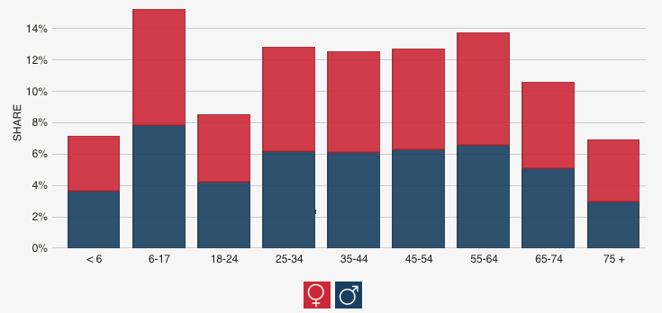

```{r setup, include = FALSE}
library(here)
library(tidyverse)
library(rio)

theme_set(theme_minimal(base_size = 20))

knitr::opts_chunk$set(fig.width = 13, 
                      message = FALSE, 
                      warning = FALSE)
options(pillar.sigfig = 7)
```

# Agenda
* Publishing slides with GitHub
* Review where we've been
* Lab

---
class: inverse center middle
# Publishing slides w/GitHUb
### Demo
(RMarkdown Slides and a quick note on {xaringan})

---
## Tidyverse: Providing a grammar for...
* Graphics (ggplot)
* Data manipulations (dplyr)
* Tidying data (tidyr)

---
class: inverse center middle
# dplyr

---
## dplyr: A grammar for data wrangling
* `select()`: A subset of columns
* `filter()`: A subset of rows
* `mutate()`: Add or modify existing columns
* `arrange()`: Rows in a ascending or descending order
* `summarize()`: A variable according to other functions (e.g., `mean()`, `sd()`). Often used in conjunction with `group_by()`
* `group_by`: Group a data frame according to a specific variable (usually a factor)

<div align = "right">

</div>


---
# Arguments
* *dplyr* always takes a data frame as its first argument. 
* Subsequent argument tell *dplyr* what to do with the data frame.
* Returns the modified data frame

---
# `select()` 
<div align = "center">

</div>


.footnote[Figure from Baumer, Kaplan, & Horton, 2017]

---
# `filter()` 

<div align = "center">

</div>

.footnote[Figure from Baumer, Kaplan, & Horton, 2017]

---
# Helper funs
* `starts_with()`
* `ends_with()`
* `contains()`

--

**Note:** These can be used in other functions as well (e.g., `gather`)

---
# Mix types

Mix types and helper funs. Use select to rearrange columns.

```{r mixed_types_select}
library(tidyverse)
diamonds %>% 
    select(depth, 6, starts_with("c"), price)
```

---
# `filter()` boolean logic
Left circle == x, right circle == y

<div align = "center">

</div>

.footnote[Figure from Wickham & Grolemund, 2017]

---
## Create or overwrite variables: `mutate`

### First: Load the data

```{r load-reads}
library(rio)
library(here)
reads <- import(here("data", "Project_Reads_Scores.csv"), 
                setclass = "tbl_df") %>%
  janitor::clean_names()
```

---
# Calculate gain score

```{r create_var}
reads %>% 
  mutate(gain = post_test_score - pre_test_score) %>% 
  select(student_id, 5, 7, gain)
```

---
# Overwrite a variable

```{r overwrite}
reads %>% 
  mutate(pre_test_score = scale(pre_test_score),
         post_test_score = scale(post_test_score)) %>% 
  select(student_id, 5, 7)
```

---
# `summarize` column(s)

* Average pre/post and gain

```{r summarize}
reads %>% 
  mutate(gain = post_test_score - pre_test_score) %>% 
  summarize(av_pre = mean(pre_test_score, na.rm = TRUE),
            av_post = mean(post_test_score, na.rm = TRUE),
            av_gain = mean(gain, na.rm = TRUE))
```

---
# Summaries by group
* Use `group_by` to get the same summaries by a grouping factor. 
Mean pre/post and gain by test site

```{r group_by}
reads %>% 
  mutate(gain = post_test_score - pre_test_score) %>% 
  group_by(test_site) %>% 
  summarize(av_pre = mean(pre_test_score, na.rm = TRUE),
            av_post = mean(post_test_score, na.rm = TRUE),
            av_gain = mean(gain, na.rm = TRUE))
```

---
# Conditional verbs
### I mentioned these, but we never covered them
* `*_if`, `*_all` functions can help with efficiency

```{r _if_all}
reads %>% 
  select_if(is.numeric) %>% 
  summarize_all(mean, na.rm = TRUE)
```

---

* `*_at`

```{r _at}
reads %>%
  summarize_at(vars(unit_1_score, unit_3_score, unit_7_score), 
               funs(mean, sd))
```
 

---
class: inverse center middle
# Data visualization

---
# Reviewing ggplot2 syntax
* `aes()` accesses the variables in your dataset.

--
* Set aesthetics globally outside of `aes()`

--
* Aesthetics set in first call to `ggplot` will bleed through to subsequent layers.

--
* Change aesthetics within a specific layer by providing arguments within that specific function.

--
* Can even change x/y axes, which can be helpful if you want it defined as categorical for one layer and continuous for a second. Or if you want to plot summary data over the top of the raw data (or vice versa).

---
# Pop Quiz 1
What's different about these plots

.pull-left[

```{r ggplot_color, echo = FALSE, fig.width = 6.5, warning = FALSE}
library(ggplot2)
library(gapminder)

gapminder %>% 
  group_by(continent, year) %>% 
  summarize_all(mean) %>% 
  ggplot(aes(year, gdpPercap, group = continent)) +
    geom_line(alpha = 0.3) 
```
]

.pull-right[

```{r ggplot_group, echo = FALSE, fig.width = 6.5, warning = FALSE}
gapminder %>% 
  group_by(continent, year) %>% 
  summarize_all(mean) %>% 
  ggplot(aes(year, gdpPercap, color = continent)) +
    geom_line() 
```
]

---
# Pop Quiz 2
What went wrong here?

```{r change_color, echo = FALSE}
ggplot(gapminder, aes(year, gdpPercap, group = country)) +
  geom_line(aes(color = "cornflowerblue"))
```

---
# Thinking about scales some
### A bit more new stuff
* Same plot, different scales. Which can you see the relation better?

.pull-left[
```{r raw_y, fig.width = 6.5, fig.height = 5}
ggplot(gapminder, aes(year, gdpPercap, group = country)) +
  geom_line(alpha = 0.3)
```
]

.pull-right[

```{r log_10_y, fig.width = 6.5, fig.height = 4.5,}
ggplot(gapminder, aes(year, gdpPercap, group = country)) +
  geom_line(alpha = 0.3) +
  scale_y_log10(label = scales::dollar)
```
]

---
# Pop Quiz 3
Can you reproduce this plot? (you'll need the gapminder package/data)

```{r gapminder}
# install.packages(gapminder)
library(gapminder)
```

```{r gpd_faceted1, echo = FALSE, fig.height = 5.5}
ggplot(gapminder, aes(year, gdpPercap)) +
  geom_smooth() +
  scale_y_log10(labels = scales::dollar) +
  facet_wrap(~continent, nrow = 1) +
  labs(x = "Year", 
       y = "GDP per capita",
       title = "GDP per capita for Five Continents") +
  theme(axis.text.x = element_text(size = 10))
```


---
# What about this one?
```{r gpd_faceted2, echo = FALSE}
ggplot(gapminder, aes(year, gdpPercap)) +
  geom_line(aes(group = country), alpha = 0.3) +
  scale_y_log10(labels=scales::dollar) +
  facet_wrap(~continent, nrow = 1) +
  labs(x = "Year", 
       y = "GDP per capita",
       title = "GDP per capita for Five Continents") +
  theme(axis.text.x = element_text(size = 10))
```

---
# Can you combine them?
```{r gpd_faceted3, echo = FALSE, fig.width = 13, message = FALSE}
ggplot(gapminder, aes(year, gdpPercap)) +
  geom_smooth(se = FALSE, size = 1.2, color = "orchid1") +
  geom_line(aes(group = country), alpha = 0.3) +
  scale_y_log10(labels=scales::dollar) +
  facet_wrap(~continent, nrow = 1) +
  labs(x = "Year", 
       y = "GDP per capita",
       title = "GDP per capita for Five Continents") +
  theme(axis.text.x = element_text(size = 10))
```

---
class: inverse center middle
# tidy data and *tidyr*

---
# Review Homework 4
* Tidy the reads dataset, minus columns 5-9

```{r head_reads}
reads %>% 
  select(-5:-9)
```

---
# Common mistakes 
* Forget to filter out summary rows
* Multiple gathers

---
# Common thought process
* `gather` once for raw scores, and a second time for percentages. 
* Anything wrong with this? 

```{r double_gather1}
double_gather <- reads %>% 
  select(4, 1:3, 10:23) %>% 
  filter(student_id != "All Students (Average)") %>% 
  gather(unit, score, contains("score")) %>% 
  gather(unit2, percent, contains("percent")) %>% 
  mutate(unit = readr::parse_number(unit)) %>% 
  select(-unit2)
```

---
```{r double_gather2}
double_gather
```

---
# What's going on?

```{r double_gather3}
double_gather %>% 
  count(student_id) 
```

---
# n rows by n gathers
* Assuming 7 columns are gathered each time:

```{r gather_exponential, fig.height = 5}
expo <- tibble(gathers = 1:5, nrows = 7^(1:5))
ggplot(expo, aes(gathers, nrows)) + geom_line()
```

---
# Alternative
* Gather all, then spread. **BUT**, requires common names to parse out the variables that are currently stored in the column names.

```{r reads_tidy}
reads_tidy <- reads %>% 
  select(4, 1:3, 10:23) %>% 
  rename("unit_56_score" = "unit_5_6_score", 
         "unit_56_percent" = "unit_5_6_percent") %>%
  filter(student_id != "All Students (Average)") %>% 
  gather(var, val, -1:-4) %>% 
  separate(var, c("dis", "unit", "type"), sep = "_") %>% 
  select(-dis) %>% 
  spread(type, val)
```

---
```{r look-tidy}
reads_tidy
```

---
# Quick challenge (15 minutes)
* The following plot comes from [datausa](https://datausa.io/profile/geo/oregon/#economy) for Oregon residents.
* The data are stored in a file called *insurance_coverage.csv*
    + Load the data into R and reproduce the plot as best you can



---
# My method
* Load the data

```{r load_insurance_data}
insurance <- import(here("data", "insurance_coverage.csv"), 
                         skip =  3, 
                         setclass = "tbl_df") %>% 
  janitor::clean_names()
insurance
```

---
# Compute percentages
```{r insurance_summaries}
smry <- insurance %>% 
  group_by(in_oregon_csvage_bucket, sex_name) %>% 
  summarize(by_sex = sum(hc_pop)) %>% 
  ungroup() %>% 
  mutate(percentage = by_sex /sum(by_sex))

smry
```

---
# Reorder and re-level age ranges

```{r relevel_factor}
smry <- smry %>% 
  separate(in_oregon_csvage_bucket, c("dis", "age_range")) %>%
  mutate(age_range = factor(age_range,
                            levels = c("under_6", 
                                       "6to17", 
                                       "18to24", 
                                       "25to34", 
                                       "35to44", 
                                       "45to54", 
                                       "55to64", 
                                       "65to74",
                                       "75plus"),
                            labels = c("< 6", 
                                       "6-17", 
                                       "18-24", 
                                       "25-34", 
                                       "35-44",
                                       "45-54", 
                                       "55-64", 
                                       "65-74", 
                                       "75 +")))
```

---
# Produce the plot
```{r reproduce_plot, fig.height = 4, fig.width = 10}
ggplot(smry, aes(age_range, percentage, fill = sex_name)) +
  geom_col(alpha = 0.9) +
  scale_fill_manual(values = c("firebrick3", "#323560")) +
  scale_y_continuous(name = "SHARE", 
                     breaks = seq(0, 0.14, 0.02),
                     labels = scales::percent) +
  xlab("") +
  ggthemes::theme_hc()
```

---
# Make it interactive
```{r plotly}
library(plotly)
p <- ggplot(smry, aes(age_range, percentage, fill = sex_name)) +
  geom_bar(stat = "identity",  alpha = 0.9) +
  scale_fill_manual(values = c("firebrick3", "#323560")) +
  scale_y_continuous(name = "SHARE", 
                     breaks = seq(0, 0.14, 0.02),
                     labels = scales::percent) +
  xlab("") +
  ggthemes::theme_hc()
```

```{r save_plotly, echo = FALSE}
htmlwidgets::saveWidget(ggplotly(p), here("weeks", "img", "p.html"))
```

---
```{r plotly-show, eval = FALSE}
ggplotly(p)
```

<iframe src= "../img/p.html" width="100%" height="400" id="igraph"
scrolling="no"
seamless="seamless" frameBorder="0"> </iframe>


---
class: inverse center middle
# Lab
### Get some slides published!
